# SAFETY EVALUATION OF THE 10 MeV LINAC BUNKER AT RSUP Dr. HASAN SADIKIN USING THE OpenMC SIMULATION METHOD

**UNDERGRADUATE THESIS (SKRIPSI)**

Submitted in partial fulfillment of the requirements for the Degree of Bachelor in the Nuclear Engineering Study Program

Submitted by
**MUHAMMAD ARYA HANIF**
19/443954/TK/49150

To the
DEPARTMENT OF NUCLEAR ENGINEERING AND ENGINEERING PHYSICS
FACULTY OF ENGINEERING
UNIVERSITAS GADJAH MADA
YOGYAKARTA
2024

---

## STATEMENT OF ORIGINALITY (Plagiarism-Free Declaration)

I, the undersigned:

- Name: Muhammad Arya Hanif
- Student ID (NIM): 19/443954/TK/49150
- Year of enrollment: 2019
- Study Program: Nuclear Engineering
- Faculty: Engineering

declare that this scientific thesis document contains no part of any other scientific work that has been submitted to obtain an academic degree at any institution of higher education, and contains no work or opinion ever written or published by any other person or institution, except those cited in writing in this document and acknowledged in full in the list of references.

I therefore declare that this scientific document is free from elements of plagiarism, and should this thesis document later be proven to be a plagiarism of another author's work and/or to deliberately present work or opinion that is the result of another author's work, I am prepared to accept the applicable academic and/or legal sanctions.

Yogyakarta, 30 July 2024

Muhammad Arya Hanif
NIM. 19/443954/TK/49150

---

## PAGE OF RATIFICATION (Approval Page)

**UNDERGRADUATE THESIS**

SAFETY EVALUATION OF THE 10 MeV LINAC BUNKER AT RSUP Dr. HASAN SADIKIN USING THE OpenMC SIMULATION METHOD

- Student Name: Muhammad Arya Hanif
- Student Number: 19/443954/TK/49150
- Principal Supervisor: Ir. Anung Muharini, M.T., IPM.
- Co-Supervisor: Anisza Okselia, S.T., M.Si.

This thesis was defended before the Examination Committee on 23 July 2024.

- Session Chair: Ir. Anung Muharini, M.T., IPM.
- Principal Examiner: Ir. Susetyo Hario Putero, M.Eng.
- Examination Member: M. Arif Efendi, S.Si., M.Sc.

This thesis has been accepted and declared to meet the graduation requirements on 30 July 2024.

Head of the Department of Nuclear Engineering and Engineering Physics
Faculty of Engineering, UGM

Dr. Ir. Alexander Agung, S.T., M.Sc., IPU
NIP. 19720916 199803 1002

---

*This work is dedicated to my late grandfather.*

*"We play with the cards we're dealt." - Stan Edgar*

---

## PREFACE (Acknowledgments)

Praise and gratitude to God, for by His grace and mercy the author has been able to complete this thesis. The author is grateful for the opportunity to meet and befriend remarkable people during his studies, both from within and outside the Department. The author is very proud to have known them. This expression of thanks is offered to:

1. Ms. Ir. Anung Muharini, M.T., IPM., as Principal Supervisor of the Final Project, who has always patiently guided the author and taught valuable knowledge until the author could complete this thesis.
2. Ms. Anisza Okselia, S.T., M.Si., as Internship Supervisor and Second Final-Project Supervisor, who proposed the thesis topic and provided the data needed for the thesis.
3. Ms. Sita Gandes Pinasti, S.T., M.Sc., who was willing to provide consultation on the research problems the author encountered during the writing of the thesis.
4. The staff of RSUP Dr. Hasan Sadikin (Central General Hospital), who provided a place to carry out the internship and served as the basis of the author's thesis.
5. Mr. Dr. Ir. Alexander Agung, S.T., M.Sc., IPU, as Head of the Department of Nuclear Engineering and Engineering Physics.
6. All lecturers and the academic community of the Department of Nuclear Engineering and Engineering Physics, who provided knowledge and assistance so that the author could complete his studies.
7. Parents and family members who continuously provided financial and moral support.
8. Adi, Rayhan, Owen, Helmi, Zaky, Thian, Ryan, Levi, Cesca, Ismi, and other DTNTF friends who inspired and accompanied the author through college and play.
9. Ojan, Kresna, Almas, Rapi, Nanda, and Valen, my beloved close friends who have always accompanied the author since PPSMB.
10. Joe, Lesa, Karin, Alif, the boarding-house members, and the KKN subunit and unit who accompanied the author in the middle of nowhere, sampling community life, and who still accompany the author even after KKN ended.
11. Friends from SATUBUMI, Gamabunta, and other UGM event committees that served as a place for the author to grow through learning and organizational duties.
12. Friends whom the author cannot mention one by one, who accompanied the author throughout his college years.

Yogyakarta, 19 July 2023

Muhammad Arya Hanif

---

## LIST OF SYMBOLS AND ABBREVIATIONS

### Roman Symbols

| Symbol | Quantity | Unit |
|--------|----------|------|
| d_sec | Distance from isocenter to measurement point | cm |
| Ḋ | Dose Rate | Sieverts/hour |
| Da | Dose per fluence | Sieverts cm² |
| Ḋmax | Maximum Dose Rate | Sieverts/hour |
| Do | Output Dose of the OpenMC function | Sieverts |
| Dosk | Output Dose of the Calibration Cell | Sieverts |
| Ḋ | Dose Rate of the Linear Accelerator | MU/minute |
| DU | Dose based on angular utility | µSv/week |
| E | Energy | MeV |
| HVL | Half Value Layer | mm |
| S | Conversion Factor | - |
| SR | Source Rate | sources/second |
| T | Occupancy Factor | - |
| TVL | Tenth Value Layer | cm |
| T | Time | seconds |
| tw | Irradiation time to reach the workload | hours |
| U | Utility Factor | % |
| V | Volume | cm³ |
| W | Workload | Gy/week |
| X | Material thickness | m |

### Greek Symbols

| Symbol | Quantity | Unit |
|--------|----------|------|
| Φ | Simulation flux | Particle-cm / source |

### Subscripts

| Symbol | Description |
|--------|-------------|
| bo | Output |
| maks | Maximum |
| Sk | Calibration Cell |

### Abbreviations

| Abbreviation | Meaning |
|--------------|---------|
| AAPM TG | American Association of Physicists in Medicine Task Group |
| AC | Alternating Current |
| BAPETEN | Nuclear Energy Regulatory Agency (Badan Pengawas Tenaga Nuklir) |
| BNCT | Boron Neutron Capture Therapy |
| BPE | Boron Loaded Polyethylene |
| CPRG | Computational Reactor Physics Group |
| CSEWG | Cross Section Evaluation Working Group |
| Dr. | Doctor |
| ENDF | Evaluated Nuclear Data Library |
| FF | Flattening Filter |
| HVL | Half Value Layer |
| IAEA | International Atomic Energy Agency |
| KeV | Kilo electron Volt |
| LINAC | Linear Accelerator |
| MIT | Massachusetts Institute of Technology |
| MeV | Mega electron Volt |
| MV | Mega Volt |
| MU | Monitor Unit |
| NCRP | National Council on Radiation Protection & Measurements |
| NBD | Dose Limit Value (Nilai Batas Dosis) |
| RSUP | Central General Hospital (Rumah Sakit Umum Pusat) |
| SAD | Source to Axis Distance |
| TVL | Tenth Value Layer |
| UGM | Universitas Gadjah Mada |

---

## ABSTRACT (translated from the Indonesian INTISARI)

SAFETY EVALUATION OF THE 10 MeV LINAC BUNKER AT RSUP Dr. HASAN SADIKIN USING THE OpenMC SIMULATION METHOD

Muhammad Arya Hanif
19/443954/TK/49150

Submitted to the Department of Nuclear Engineering and Engineering Physics, Faculty of Engineering, Universitas Gadjah Mada on 12 July 2024, in partial fulfillment of the requirements for the Degree of Bachelor in the Nuclear Engineering Study Program.

This research was conducted to evaluate the safety of the LINAC Elekta Synergy radiotherapy bunker design built at RSUP Dr. Hasan Sadikin. Visualization of the dose distribution was performed to help interpret the dose distribution in the LINAC bunker.

The evaluation was carried out using Monte Carlo simulation through the OpenMC particle transport code version 0.13.1. Dose-rate measurements were performed at varying distances of 30, 100, and 200 cm from the bunker wall. The occupancy, utility, and workload factors were used to determine the applicable dose limit values at those points.

The dose rate around the room ranged from 8.28 × 10⁻³ to 0.208 µSv/week. This value is far smaller than the dose constraint enforced by BAPETEN in Regulation (Perka) No. 4 of 2013. This means that the bunker's safety already complies with the applicable standard. Dose-rate visualization was also carried out to help interpret the dose occurring at each dose-rate measurement point around the bunker.

Keywords: LINAC, OpenMC, Monte Carlo Simulation, Radiation Protection

Principal Supervisor: Ir. Anung Muharini, M.T., IPM.
Co-Supervisor: Anisza Okselia, S.T., M.Si.

---

## ABSTRACT (original English text)

SAFETY EVALUATION OF HASAN SADIKIN HOSPITAL'S 10 MeV LINAC BUNKER USING OpenMC SIMULATION METHOD

Muhammad Arya Hanif
19/443954/TK/49150

Submitted to the Department of Nuclear Engineering and Engineering Physics, Faculty of Engineering, Universitas Gadjah Mada on July 12, 2024, in partial fulfillment of the requirement for the Degree of Bachelor of Engineering in Nuclear Engineering.

This study will examine the safety of the LINAC Elekta Synergy bunker room at RSUP Dr. Hasan Sadikin. The safety examination will be conducted by comparing the radiation dose in the surrounding rooms with the dose limit enforced by BAPETEN. Visualization of the dose will be done to help the interpretation of the dose spread occurring in the bunker.

The examination is executed using Monte Carlo simulation provided by version 0.13.1 of the OpenMC particle transport code. This research was carried out by evaluating the surrounding rooms' dose at varying distances of 30, 100, and 200 cm to the bunker wall. Occupancy, utility, and workload factors will be used to determine the dose limit values that apply at each of these points.

The dose surrounding the room is detected in the range of 8.28 × 10⁻³ to 0.208 µSv/week. This is already much smaller than the implemented rule enforced by BAPETEN in Perka No. 3 of 2013. This means that the safety of the design is in accordance with the standard. Dose-rate visualization has also been carried out to help interpret the dose that occurs at each dose-rate measurement point around the bunker.

Keywords: LINAC, OpenMC, Monte Carlo Simulation, Radiation Protection

Supervisor: Ir. Anung Muharini, M.T., IPM.
Co-supervisor: Anisza Okselia, S.T., M.Si.

---

# CHAPTER I. INTRODUCTION

## I.1. Background

Radiotherapy is one of the three main methods for treating cancer. The three main methods are surgery as the physical method, chemotherapy as the chemical method, and radiotherapy as the physics-based method. There are 66 radiotherapy units in 44 cancer-treatment centers spread across 16 provinces in Indonesia [1]. This means there was a radiotherapy-unit density of 0.247 per million Indonesian inhabitants in that year. This is quite far from the target of 7 radiotherapy units per million inhabitants recommended by the International Atomic Energy Agency (IAEA) [2]. It also means that a large number of radiotherapy bunkers must be built to reach that target.

A radiotherapy bunker is a room intended to protect the general public and hospital workers from the radiation emitted by a radiotherapy facility. The Linear Accelerator (LINAC) Synergy bunker at RSUP Dr. Hasan Sadikin has gone through a series of design and verification stages before becoming operational. The regulation that must be considered is Article 41 of BAPETEN Chairman Regulation No. 4 of 2013 concerning dose constraints for radiation workers and the public [3]. Then, to meet that standard, nuclear organizations such as the IAEA and the National Council on Radiation Protection & Measurements (NCRP) have developed calculation methods to satisfy the previously established standards [4]. In addition, there is the NCRP Report No. 151 document, which serves as a guide for building radiotherapy safety facilities [5]. This regulation was created to facilitate the optimization of benefit against risk in the use of radiotherapy facilities. The optimization method can also be carried out using computer simulation to ensure that the dose rate around the bunker room complies with the applicable standard. A radiotherapy bunker design formed based on that regulation can then be checked using analytical calculations or dose-rate measurements after installation.

Analytical calculations are performed at points behind the constructed bunker wall. The wall thickness between the LINAC and that point is then compared with the minimum wall-thickness value of the bunker so that the dose rate can be lower than the dose constraint. After the bunker is built and the LINAC is installed in the room, irradiation at maximum dose is performed so that the dose rate in the surrounding buildings can be checked. Based on this examination, the dose rate on the bunker roof exceeded 5 µSv/hour. This is assessed as greater than the dose constraint set by BAPETEN in Perka No. 3 of 2013, which is 200 µSv/week. Moreover, the measurement results do not always show a lower dose rate at greater distances. This contradicts the inverse square law applied in the dose-rate calculation. Interpretation of that dose rate can be carried out by visualizing the dose-rate distribution in the room using computer simulation.

Computer simulation is a method that can be used to design instruments and the supporting facilities for the use of instruments that involve radiation. This is because building a prototype often involves components that are not inexpensive to make. In addition, the probabilistic and invisible nature of radiation makes checking parameters during instrument fabrication not as easy as for instruments with visible parameters. This makes simulation, with its ability to visualize radiation, capable of providing more complete data and flexibility in managing the produced data. Simulation can be used for facility planning, design research, parameter optimization, and so on [6]. One advantage of simulation is the visualization of dose distribution and particle movement. That advantage is something that neither analytical calculation nor direct measurement possesses. Despite this advantage, simulation accuracy depends heavily on how detailed the geometry and parameters defined in the simulation are. The visualization produced by the simulation can help interpret the dose distribution that occurs in a radiotherapy facility.

## I.2. Problem Formulation

After the bunker design is created based on the existing regulation, the design will be simulated to determine the estimated dose received in each room around the LINAC. Based on that dose rate, it is possible to estimate how much dose is received by workers each week. Based on the above, the problem formulation to solve this matter is as follows:

1. What is the dose rate around the bunker room according to the OpenMC simulation?
2. What is the dose distribution in the LINAC bunker room?
3. Does the simulated dose rate meet the dose constraint?

## I.3. Research Objectives

1. To analyze the LINAC dose distribution in the bunker.
2. To determine the safety of the LINAC bunker.

## I.4. Research Benefits

To add input for the management of RSUP Dr. Hasan Sadikin for the radiation-safety management of health workers and the general public in the Synergy bunker room.

## I.5. Scope and Limitations

There are several limitations to this research, among them:

1. The detector uses a simple detection tally and does not replicate the actual detector design.
2. Irradiation uses a simplified LINAC geometry model with an energy of 10 MeV.
3. The Monte Carlo simulation uses OpenMC version 0.13.1.
4. The bunker design studied is the LINAC Synergy bunker design at RSUP Dr. Hasan Sadikin.
5. The simulation uses 1,000,000,000 particles with 3 batches.
6. The study is not performed on the top side or the southern side of the bunker.

---

# CHAPTER II. LITERATURE REVIEW

A LINAC bunker room requires different specifications compared with ordinary hospital rooms. This is because the primary radiation, secondary radiation, and the neutronics produced by high-energy photons require different thicknesses and materials compared with ordinary hospital rooms. Therefore, the placement and construction are quite costly. This makes the reuse of a radiotherapy bunker room cut significant costs. Despite such cost reduction, safety remains the priority in realizing a radiotherapy facility. Based on a study conducted by A.S. Ferdiansyah, the repurposing of a 6 MeV LINAC bunker to 10 MeV can be done by adding 2 cm of iron-oxide nanoparticles and boron carbide to the waiting room, roof, and archive room of the LINAC bunker at RSUP Dr. Sardjito. Iron oxide was chosen because it has high attenuation of fast neutrons, while boron carbide has high attenuation of thermal to epithermal neutron radiation [7].

Radiation-dose measurement outside the LINAC bunker room had also previously been performed by the vendor at RSUP Dr. Sardjito. That study found that the radiation dose did not reach 2 μSv/h across the entire area around the radiotherapy room, except in front of the door at 4.7 μSv/h. The measurement was performed at seven different points around the bunker room. Based on that research, in his thesis Y. M. Dinata suggested that the bunker door be thickened using lead [8].

The use of simulation to examine the dose rate around a hot-lab room has also been performed to study the economic factors of combinations of bunker wall materials. In his research, A. Rafi combined concrete, concrete with a 1 cm lead layer, and concrete with a 2 cm lead layer. The use of a lead layer can reduce the wall thickness by up to 5 cm at certain points. Lead lining can cost up to seven times more than using only concrete. This research concluded that the most optimal design in terms of radiation protection and economics is the hot-lab design without lead lining on the bunker wall [9].

Simulation has also been performed by N. K. T. Kusnaedi for designing a bunker room for a 30 MeV radiotherapy facility. That energy is produced by a cyclotron used in a Boron Neutron Capture Therapy (BNCT) facility. The maximum radiation-dose standard enforced by BAPETEN for radiotherapy facilities was successfully met in that bunker design. The required wall thickness was 100 cm to 350 cm of concrete and 100 cm to 250 cm of boron concrete and barite concrete [10].

OpenMC is one of the open-source codes used in designing radioactive facilities. Bunker safety evaluation using this photon and neutron transport simulation code had previously been performed on the bunker of Jogja International Hospital. In that study, the analytical and simulation results were compared. That research successfully determined that the bunker complied with BAPETEN safety standards based on both the OpenMC simulation and the analytical calculation. It was also found that the bunker required the addition of at least 92 millimeters of Boron Loaded Polyethylene (BPE) thickness [11].

Research to validate the credibility of Monte Carlo simulation results on a LINAC profile has also been performed by replicating Quality Assurance (QA) on a TrueBeam STx variant LINAC at Songklanagarind Hospital. This research, conducted by M.A. Efendi, used the PRIMO code to simulate the Percentage Depth Dose (PDD) and lateral profile using LINAC geometry. The simulation results were consistent with the experimental results, the Analytical Anisotropic Algorithm (AAA) calculation, and the golden beam provided by the manufacturer. PRIMO is a Monte Carlo code intended specifically for radiotherapy [12].


---

# CHAPTER III. THEORETICAL BACKGROUND

## III.1. Radiation

Radiation is the propagation of energy that does not require a medium or space and is subsequently absorbed by another object. There are several ways to classify radiation, one of which is by its ability to ionize other atoms. In this category, there are two types of radiation: ionizing radiation and non-ionizing radiation [13]. Ionizing energy is generally in the range of kilo-electron volts and mega-electron volts [14]. For particle radiation, ionizing radiation is radiation that carries sufficiently high energy. The type of particle and the energy are the main factors in radiation protection and the main determinants of the effect of radiation on a material [15].

### III.1.1. Interaction of Photons with Matter

A photon is a discrete packet of electromagnetic energy that can interact with other particles such as atoms [16]. For photon radiation, the wavelength of ionizing radiation is roughly less than 10 nm [13]. There are many reactions that can result from the interaction of photons with matter. However, the three main interactions are the photoelectric effect, Compton scattering, and pair production.

#### III.1.1.1. Photoelectric Effect

The photoelectric effect occurs when a photon and an electron bound to an atom collide. The energy of that photon then makes the electron in the atom break free as a free electron [13]. This photoelectric interaction only occurs if the binding energy of that electron is equal to or smaller than the energy carried by the photon [17].

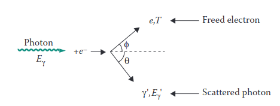 
 *Figure 3.1. Illustration of the Photoelectric Effect [13]*

#### III.1.1.2. Compton Scattering

Compton scattering occurs when a photon with energy in the keV range or higher strikes a free electron. A free electron has energy in the eV range. The electron that is struck will then be ejected in a different direction.

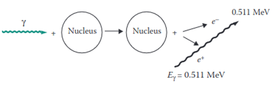 
 *Figure 3.2. Illustration of Compton Scattering [13]*

#### III.1.1.3. Pair Production

Pair production occurs when a high-energy photon strikes a nucleus. The energy of 1.022 MeV carried by that photon is then converted into an electron and a positron. The remaining energy is then distributed evenly between those two particles.

 
 *Figure III.1. Illustration of the Pair Production Effect [13]*

#### III.1.1.4. Photodisintegration

Photodisintegration, or the photonuclear reaction, occurs when a nucleus captures a high-energy photon and ejects a neutron present in the nucleus [17]. The neutron produced can be absorbed by various materials, which then makes those materials radioactive. The photodisintegration reaction can only occur when the photon energy exceeds 7 MeV [15]. Photoneutrons usually have higher energy than thermal neutrons.

### III.1.2. Interaction of Electrons with Matter

There are two types of photons that arise from the interaction of electrons with a material. An electron that loses energy due to the reduction of energy in the electromagnetic field of the nucleus releases the absorbed energy as a photon, which is called Bremsstrahlung [14]. The interaction that creates X-rays is generally the Bremsstrahlung interaction. The Bremsstrahlung reaction can also occur when that electron strikes an electron present in an atom. About 80% of the photon energy produced at 100 keV is Bremsstrahlung radiation, and the remainder is characteristic X-rays. Meanwhile, for electrons on the order of MeV, the amount of Bremsstrahlung becomes so dominant that characteristic X-rays can be neglected. Characteristic X-rays occur when an electron strikes and dislodges another electron. The position of that electron is then taken over by another electron with a lower energy level, and the remaining energy is emitted as a characteristic X-ray.

### III.1.3. Interaction of Neutrons with Matter

Neutrons can interact with a nucleus only through the nuclear force, because neutrons have no polarity [13]. When a neutron approaches a nucleus, the neutron cannot be influenced by the magnetic field of an atom. This makes nuclear interactions more likely to occur in the interaction of neutrons with matter compared with charged particles. There are two types of interactions that occur: scattering and absorption.

#### III.1.3.1. Scattering

In a scattering interaction, the neutron interacts with the nucleus. However, both particles reappear after the reaction occurs, with the same atomic number and mass number as before. There are two particle interactions that can occur: elastic and inelastic. In the elastic interaction, the kinetic energy of both particles is balanced without a change in the total kinetic energy. In the inelastic interaction, part of the kinetic energy is converted into excitation energy in the nucleus. That nucleus then undergoes de-excitation by releasing that energy as a photon.

#### III.1.3.2. Absorption

When absorption occurs, the neutron disappears. After the neutron disappears, one or more particles appear. The particles that can be produced include neutrons, protons, helium nuclei, gamma rays, and atoms different from the atom that was struck.

## III.2. Dosimetry

Radiation dosimetry refers to the measurement, calculation, and estimation of the ionizing radiation received by an object, including the human body. This includes radiation that enters internally through ingestion or respiration, as well as externally, such as from a LINAC. The distinction of dose into absorbed dose and equivalent dose is needed because the biological effect on healthy human cells is strongly influenced by the type of radiation and the energy of that radiation.

### III.2.1. Absorbed Dose

The energy absorbed by a mass during the use of radiation is measured by the quantity Gray (Gy). The energy absorbed by that mass is the energy delivered by the radiation. This value is also used in assessing the amount of energy received by a cancer. This is because the weighting factor of a particular radiation type for a cancer has a value different from the weighting factor for healthy tissue.

### III.2.2. Equivalent Dose

Equivalent dose is the amount of radiation energy absorbed in healthy tissue. This value is commonly used in radiation protection of radiation workers in the use of radioactive facilities. The use of absorbed dose is done because radiation has different effects on human tissue depending on the type and energy of that radiation. This factor is called the weighting factor. To obtain the equivalent dose, the absorbed-dose value is multiplied by the weighting factor. Its international unit is still the same as for absorbed dose. The weighting factor is 1 for photon and electron radiation, 20 for alpha radiation, and 2-10 for neutrons depending on the amount of their energy [15].

## III.3. Radiation Protection

Radiation protection is the action taken to reduce the influence of radiation exposure on radiation workers and the general public. In the use of a LINAC, the intensity of radiation is minimized through the process of attenuation [15]. The design of a radiotherapy bunker is guided by NCRP 151 and SRS 47. Those documents are used as guidelines in constructing the primary wall, secondary wall, and bunker door. Concepts such as the angular utility of the LINAC and occupancy are used to calculate the expected dose received by workers at the studied point.

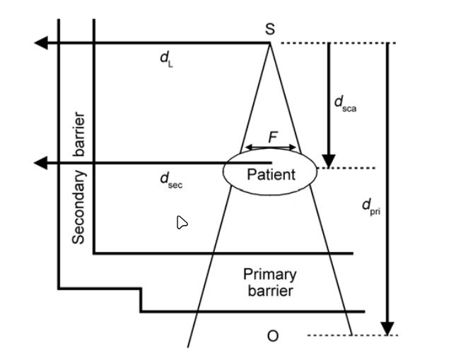 
 *Figure III.2. Illustration of the types of walls and distances of a LINAC bunker room [5]*

### III.3.1. Dose Constraint (P)

The dose constraint is the upper limit of dose for radiation workers and members of the public. The dose constraint for radiation workers is half of the annual Dose Limit Value (NBD), or 10 mSv per year [3]. This value is then regulated in detail in BAPETEN Chairman Regulation No. 3 of 2013. In that regulation, the dose constraint for radiation workers is 0.2 mSv per week [18], while for the public it is 0.01 mSv per week. Those values are found by dividing the NBD into weeks, with 50 weeks per year. The dose constraint can then be achieved by considering the workload, occupancy factor, and utility factor of the LINAC operation.

### III.3.2. Workload (W)

The workload, also called workload, is the total dose emitted by the LINAC during the irradiation fractions that are carried out. This value is obtained using the dose fraction per irradiation, the number of patients per day, and the number of working days of operating the instrument.

In the analytical calculation for the secondary wall, there is a value C that determines the workload of the treatment. This value is 4.5 for VMAT and IMRT, and 1 for conventional treatment as well as for Quality Assurance (QA).

### III.3.3. Utility Factor (U)

The utility factor is the percentage of workload in which the beam is directed at a particular primary barrier. The smaller this value, the greater the tolerance of the dose-rate value at the point behind the wall.

**Table III.1. LINAC Utility Factor [18]**

| Angle (90° interval) | U (%) |
|----------------------|-------|
| 0° (bottom) | 31.0 |
| 90° and 270° | 21.3 |
| 180° (top) | 26.3 |

### III.3.4. Occupancy Factor (T)

The occupancy factor is the average amount of time a person is exposed to the LINAC when irradiation is performed. The greater the occupancy value, the greater the wall thickness required to reach the target attenuation value in the wall. The occupancy value is closely related to the categorization of the rooms around the bunker. Room categories in a nuclear facility are divided into two: controlled areas and uncontrolled areas [17]. All rooms around the LINAC Synergy bunker are controlled rooms accessible only by workers. Therefore, the applied dose constraint is the dose limit for radiation workers.

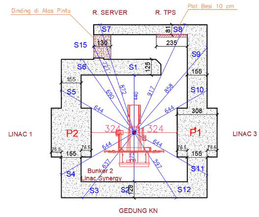 
 *Figure III.3. Floor plan of the LINAC Synergy room and its surroundings [19]*

**Table III.2. Occupancy Factor for Rooms Around the Bunker [5]**

| Occupancy Factor Value | Type of Room |
|------------------------|--------------|
| 1 | Treatment planning system room and operator room |
| 0.5 | Nuclear medicine building and bunker |
| 0.2 | Corridor |
| 0.125 | Room in front of the treatment door |
| 0.025 | Roof |

It can be seen through Figure III.4 that there are 15 secondary walls and two primary walls that must be studied through analytical calculation. The distance of the primary wall is represented by the red line, while the secondary wall is represented by the blue line. The difference in occupancy value at each of those points is represented by the type of room located on the other side of that bunker. In the operator/server room and the treatment planning system (TPS) room, the occupancy value is calculated as a workers' room. Meanwhile, for LINAC bunker 3 and the Nuclear Medicine Building, the study is carried out as a treatment room.

## III.4. Linear Accelerator

A linear accelerator is one type of accelerator. An accelerator is a device that can increase the energy of a charged particle such as an electron, proton, deuteron, triton, alpha particle, subatomic particles, or positive and negative ions [20].

Unlike telecobalt and brachytherapy, which require a raw material in the form of a radionuclide, a LINAC can operate as long as there is an electrical supply and the device is not damaged. The radiation produced by a LINAC ranges from 4 MeV to 25 MeV. That energy is higher than telecobalt, which has energies of 1.17 and 1.33 MeV. This variable energy also allows the LINAC to effectively reach tumors both at shallow depths and tumors buried under a large amount of fatty tissue.

### III.4.1. LINAC Components

There are several main components of a linear accelerator, among them the X-ray tube, focusing coil, target, and collimator. The potential difference in the X-ray tube releases electrons, whose energy can then be increased by the focusing coil. Those electrons then strike a target, which is usually an element with a high atomic number. That target then creates Bremsstrahlung radiation, which is then used to irradiate the cancer.

### III.4.2. LINAC Output Dose Calibration

There are two types of calibration performed in the operation of a LINAC: relative calibration and absolute calibration.

#### III.4.2.1. Relative Calibration

Relative calibration is the process of comparing the radiation-dose measurement at a particular point with the dose measurement at a reference point whose value is already known. Relative calibration on a LINAC aims to ensure that the radiation dose produced by this machine is accurate and consistent. This calibration process begins by determining the reference point. The reference point used on a LINAC is the dose at the maximum value of its depth dose. Dose measurement is performed so that it can then be compared with the reference point. From this, the correction factor for the LINAC profile can be created.

### III.4.3. Absolute Calibration

Absolute calibration is the calibration of a LINAC performed through an ionization chamber located in the LINAC head. In that calibration, the Monitor Unit (MU) value is calibrated so that it is equivalent to 1 cGy at the depth with maximum output dose [21]. The MU value is the quantity of dose produced by the LINAC. This MU value is continuously checked for its uniformity and equivalence so that it is always ±1% of the value relative to cGy. This is in accordance with the guidelines provided by the American Association of Physicists in Medicine Task Group 40 (AAPM TG) [18].

There are several other proposed methods for this MU value. One of them is equalization not at the maximum output but at a certain depth, such as 10 cm from the target-to-patient distance [22]. In a journal written by F. Heuvel, he gives the opinion that this value would be more resistant to dose-distribution errors in the patient. However, in the same journal, he also states that this argument is not strong enough, especially to change the definition that has already been implemented in the regulations for building radiotherapy bunker facilities.

## III.5. Monte Carlo

Monte Carlo is a method that uses samples of a phenomenon to estimate the population mean of that phenomenon [18]. The calculation principle and the database used as the particle-interaction probability data are explained as follows.

### III.5.1. Monte Carlo Calculation Principle

Monte Carlo data is based on two principles: the law of large numbers and the central limit theorem. The principle of the law of large numbers is that the sample mean approaches the population mean as the number of samples increases. Meanwhile, the central limit theorem principle explains that the more samples there are, the more the distribution approaches a normal distribution.

Both of these principles still hold even if the samples initially have a distribution unlike a normal distribution. This can be seen if a number of samples are drawn from the initial distribution, and then those samples are displayed as a distribution. The more samples are drawn, the more the distribution approaches a normal distribution.

### III.5.2. Empirical Database for Monte Carlo Particle Simulation

The basis of the particle-interaction probability is obtained using empirical results produced by experiments conducted by the IAEA or other nuclear institutions. The Evaluated Nuclear Data Library (ENDF) data is published by the Cross Section Evaluation Working Group (CSEWG). This document is continuously updated and supplemented to support other types of particle interactions. Monte Carlo simulation has an increasingly important role in modeling radiodiagnostic results and verifying patient treatment [15].

Previous research has proven that Monte Carlo simulation agrees with experimental measurements. This result is consistent across different energy ranges. That research compared the percentage depth dose curves produced at several different energies in simulation and direct measurement. This simulation was run at 10 MeV energy; the maximum dose Dmax is at a depth of 2.4 cm [23]. That distribution is described in Figure III.2. This result is also supported by other research comparing depth dose between linear accelerators made by Elekta and Siemens [24]. The comparison of real measurement with the Monte Carlo simulation method can be represented using Table III.1.

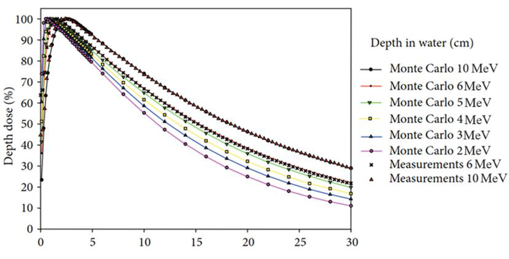 
 *Figure III.4. Percentage Depth Dose of a water phantom, simulation and real [23]*

**Table III.3. Percentage depth dose in a water phantom [23]**

| Relative Dose (%) | 10 MeV Simulation | 10 MeV Experiment | 6 MeV Simulation | 6 MeV Experiment |
|-------------------|---------|---------|---------|---------|
| 100 | 2.4 | 2.4 | 1.5 | 1.6 |
| 90 | 5.6 | 5.5 | 4.2 | 4.2 |
| 80 | 8.2 | 8.2 | 6.6 | 6.6 |
| 70 | 11.1 | 11.1 | 9.2 | 9.2 |
| 60 | 14.5 | 14.4 | 12.0 | 12.0 |
| 50 | 18.3 | 18.3 | 15.0 | 15.2 |

### III.5.3. OpenMC

OpenMC was created by the Computational Reactor Physics Group (CRPG) at the Massachusetts Institute of Technology (MIT) [20]. OpenMC uses the principle of Monte Carlo simulation for the transport of neutral particles. The numerical solution of the transport equation, also called deterministic calculation, discretizes time, energy, and angle, each of which then introduces systematic error [17]. Comparison of OpenMC simulation results with other particle transport codes such as PHITS and MCNP has also been performed and gives positive results [22]. OpenMC has also been used to design an energy modulator that was then implemented on a real LINAC [16].

#### III.5.3.1. Conversion of Flux to Equivalent Dose

The conversion of flux into equivalent dose is available in International Commission on Radiological Protection (ICRP) Publication 116, which is based on Monte Carlo calculations in the programs EGSnrc, FLUKA, GEANT4, MCNPX, and PHITS [25]. OpenMC produces a flux value in particle-cm/source. This value is then converted into µSv cm² based on the conversion provided by ICRP 116. Using the tally size mounted in the simulation, the pSv value is then found. This value is then equalized in the calibration to obtain dose per time. This dose rate is then converted into µSv/week, which is used as the dose constraint.

---

# CHAPTER IV. RESEARCH METHODOLOGY

## IV.1. Research Tools and Materials

In this research, the activity requiring research tools is the computer simulation. The computer simulation was carried out using the server available at the Department of Nuclear Engineering and Engineering Physics (DTNTF), Universitas Gadjah Mada (UGM).

### IV.1.1. Simulation

The following are the tools used in this research:

1. Zephyrus G14 Laptop
   a. AMD Ryzen 7 5800HS @3.2 GHz
   b. 16 GB Random Access Memory
2. Intel(R) Xeon(R) Silver Server
   a. Intel Xeon Silver 4112 CPU @ 2.60 GHz
   b. 32 GB Random Access Memory

Both of these computers were used to run the simulation and to read the results obtained from that simulation. The server was provided by DTNTF UGM. The programs used have open-source licenses, among them:

1. OpenMC 0.13.1
2. Python 3.8.10
3. matplotlib 3.7.5

## IV.2. Research Procedure

The general overview of this research can be described as the flow diagram below.

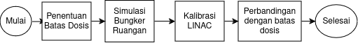 
 *Figure IV.1. Illustration of the research workflow*

### IV.2.1.1. OpenMC Modeling

The OpenMC model was created based on the initial design, which represents the conditions when the direct measurement was performed. The tally was created without imitating the detector geometry. The output value obtained from OpenMC is actually not a dose in µSv/hour, but rather the number of particles passing through the created tally. Therefore, before running the room simulation, a calibration simulation was first performed to obtain the conversion factor so that the flux output from OpenMC could be converted into µSv/hour.

The cross-section data first needs to be downloaded from the page on the OpenMC website. There are 2 datasets available, namely ENDF and JEFF. This research was carried out using the ENDF/B-VII.1 data. There is a variety of empirical research data available, such as for neutrons, electrons, photons, deuterons, and others. This data is then imported through the Linux terminal.

### IV.2.1.2. Absolute Calibration Simulation

The simulation produces particle types along with the energy carried by those particles. Based on the experimental results performed using organ phantoms by the International Commission on Radiological Protection (ICRP), the relationship between particle energy and dose per fluence is represented as Figure IV.2. The relationship between energy, flux, and dose per fluence can be written as Equation 4.1 [26]. Interpolation is performed using the data in Figure IV.2 so that particle energies not present in the table can also be converted.

> Equation (4.1)
> Da = Dose per fluence (pSv cm²)
> E = Particle energy (MeV)
> Φ = flux (particle-cm / source)

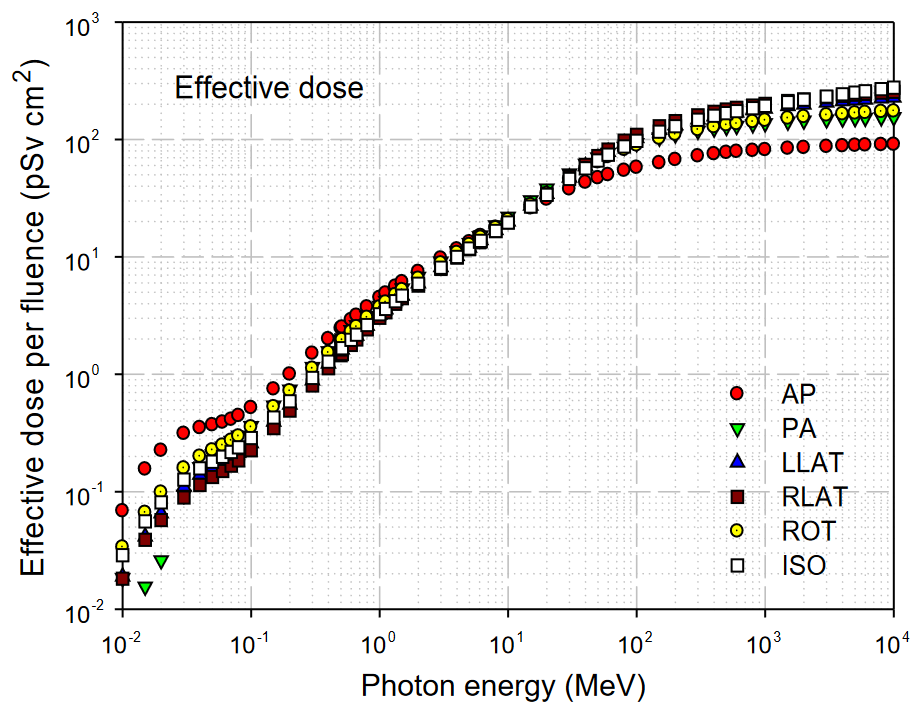 
 *Figure IV.2. Conversion of particle energy values to effective dose per fluence using organ phantoms in the irradiation direction [25].*

In Figure IV.2, the position of the irradiation direction relative to the phantom is described using the terms AP, antero-posterior; PA, postero-anterior; LLAT, left lateral; RLAT, right lateral; ROT, rotational; ISO, isotropic.

After the dose-per-fluence value is found, the flux value and the output dose are needed to determine the dose rate occurring in that simulation. This result is represented as Equation 4.2 [26].

> Equation (4.2)
> Dv = Total dose (pSv)
> SR = source / second
> t = time (seconds)
> V = volume (cm³)

A simplification of Equation 4.2 is performed to facilitate the calculation of the dose rate at the tally detectors mounted in the room geometry. That simplification is performed using a value S that represents the relationship of dose per fluence with flux and source rate. To facilitate the calculation in the simulation, that S value is also used to convert pSv/s into (µSv/hour).

> Equation (4.3)
> Ḋ = Dose rate (µSv/hour)
> S = Conversion factor (particle-...)

For a radionuclide source, the Source Rate value is provided by the data sheet available from its manufacturer. Because for a LINAC the known data is in the form of Dose Rate, dose calibration is then performed to determine the source rate required to produce the LINAC Dose Rate, namely 360 MU/min or equivalent to 360 Gy per hour.

With the change in formula as shown in Equation 4.3 and the use of the conversion factor, the equation can be simplified as Equation 4.4.

> Equation (4.4)

Since the simulation output dose value is still in the form of pSv cm³/source, the output value still needs to be divided by the volume of the calibration cell itself.

> Equation (4.5)
> Equation (4.6)
> Ḋmaks = Maximum dose rate (µSv/hour)
> DOsk = Output dose of the calibration cell (pSv)
> S = Conversion factor
> Vsk = Calibration tally volume (cm³)

The coefficient factor is then used to find the dose rate at each detector in the bunker room. The flux value along with its energy is produced by the OpenMC simulation. Then the function openmc.dose_coefficient is used to convert that energy into dose. This dose is converted into a dose rate using the conversion value found in the OpenMC calibration. The resulting value is still spread across the tally volume. Therefore, division by the tally volume used needs to be performed to obtain the dose-rate value at the measurement points.

In real conditions, the dose in a water phantom is influenced by dose scattering from the surroundings, the measurement-quality setup, the irradiation energy, and other environmental conditions such as temperature, pressure, and humidity. However, these are neglected because the simulation is performed under ideal conditions.

### IV.2.1.3. Room Simulation at 4 Gantry Angles

The simulation was performed at four different angles with a 90° interval. These values were then used to estimate the total dose received in each room every week.

This simple program is used so that the rotation angle can be chosen before the simulation is run. This makes the execution of OpenMC easier to perform. The use of the source is a replication of LINAC irradiation. A box source is used and spreads until it reaches a FIELD SIZE of 40 x 40 cm.

The energy of the photon source is distributed discretely with an energy of 10 MeV. The distribution is performed discretely and spreads evenly across a spherical volume. That distribution only occurs over the area described as the Field Size area. The position of the irradiation direction is also formulated so that it can be located 100 cm from the isocenter according to its irradiation rotation angle. This is done with the function in Appendix 1, in the form of the sposi function in Appendix A.

A flux tally was installed with an energy filter. This type of tally is needed to determine the particle type and its energy so that it can then be converted into dose per fluence according to ICRP 116.

Then several points with varying distances from the wall are used as dose-rate measurement locations. These points are then studied to be compared with the applicable dose constraint.

The geometry display is then performed on 3 axis variations so that it can be checked whether it already conforms to the bunker design or not. This geometry can also be used to display the visualization of dose distribution. The dose distribution is obtained by creating a grid tally that spreads throughout the entire room.

The source is then defined through the functions source.space, source.angle, source.energy, and source.particle. Source.space is created as a box-shaped source at the position produced by the rotation function. Then source.angle is defined as polar azimuthal. This angle distribution occurs by forming something like a spherical surface, only to the widest Field Size, namely 40x40 cm. The energy distribution occurs discretely at 10 MeV energy. This is done with the description in the source.energy function. source.particle describes the type emitted by the source. In this research, that variable is set as photon. In Figure IV.3, the building floor plan is used to depict the measurement points using the simulation.

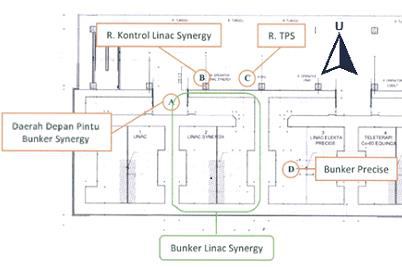 
 *Figure IV.3. Floor plan of the dose-rate measurement points in the LINAC Synergy room [19]*

## IV.3. Analysis of Research Results

After the conversion value is obtained, the simulation at 4 gantry angles is performed, and then its output dose is converted into µSv/hour, which is the dose-rate quantity more commonly used in radiation detectors. The conversion using the calibration factor and the volume of the detector tally is written simply through Equation 4.4.

After the LINAC dose rate is known, this value is used to determine the dose rate of the measurement points at each irradiation angle. Before this is done, the duration of LINAC irradiation needs to be calculated so that it can then be multiplied by the dose rate. The total operating time is found using the assumptions used in the construction document and the assumption that each irradiation is performed using the maximum DR. That time is found by determining how long it takes to reach the workload at the DR used.

> Equation (4.7)
> Equation (4.8)
> tW = LINAC operating time to reach the workload at maximum DR (hours)
> W = Workload of LINAC operation per week (Gy/week)
> Ḋ = Dose Rate of LINAC operation (MU/minute)
> DU = Dose based on the specific angular utility and LINAC workload (µSv/week)
> U = Utility factor, the percentage of the LINAC irradiating that angle compared with other gantry angles (%)

Because the workload is met by varying the LINAC irradiation angle, the utility factor issued by NCRP 151 is used. That factor represents the use of LINAC irradiation at each 90° interval. The simulation dose rate at each angle is then multiplied by that percentage. The utility dose at each LINAC angle is then summed so that the expected dose rate at each point during each week of LINAC operation can be found. Because the measurement points are located in different rooms, the time spent by radiation workers at those points will differ. This is explained and used in the analytical calculation in designing the minimum bunker thickness. The relationship between dose rate and occupancy can then be represented through Equation 4.8.

> Equation (4.8)
> Occupancy Factor (T) = This value represents the frequency of people at that point during LINAC operation.
> DTO = Total Occupancy Dose at the measurement point (µSv/week)
> W = Workload of LINAC operation per week (Gy/week)
> Ḋ = Dose Rate of LINAC operation (MU/minute)

Equation 4.8 represents the expected dose rate received at one measurement point each week. For example, in the operator room, the total dose (DTO) comes from the dose rate when the LINAC operation is directed downward (DU0) and from the other irradiation angles, which are then multiplied by the occupancy factor (T) of the operator room.

### IV.3.1. Interpretation of Radiation Geometry Distribution in the Simulation

The value produced by the simulation has the advantage that its distribution can be visualized. This will help interpret the dose distribution occurring in the LINAC room simulation. This visualization represents the dose-rate distribution occurring in that room.


---

# CHAPTER V. RESULTS AND DISCUSSION

## V.1. OpenMC Simulation Results

First, calibration was performed using a water-phantom replica. The Dmax value from that simulation was then used as the conversion of the OpenMC output dose into a dose that can be compared with the dose constraint.

### V.1.1. Calibration of Dose to Simulation Dose Rate

Calibration was performed using a water-phantom replica located 100 cm from the source. The field size of the dose-calibration simulation was 30 cm x 30 cm.

The Dmax value in the calibration was then used as the equalization for LINAC irradiation, which has a value of 600 MU/minute or equivalent to 360 µSv/hour, which can be represented through Equation 4.4.

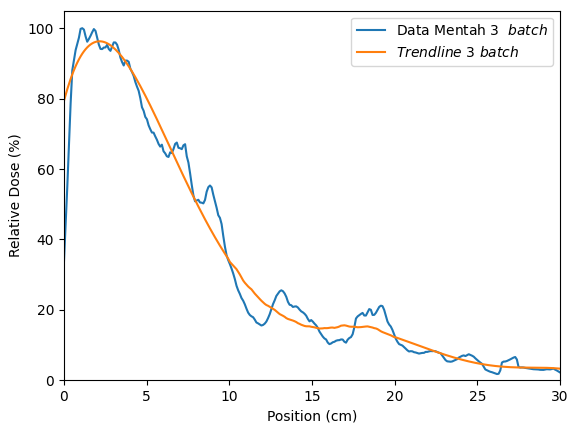 
 *Figure V.1. Percent Depth Dose (PDD) of the Water Phantom Calibration Simulation*

The PDD curve has a fairly significant difference compared with the shape in the simulation or real measurement, because the source used is a simple source. This source does not include components such as the Primary Collimator, Flattening Filter, Monitor Chamber, and Jaw as in a real LINAC head. This simulation also does not use a phase-space file in the form of a .phsp. The number of batches in this simulation is the same as the number of batches in the room simulation, namely 3 batches with 1,000,000,000 particles. It can be seen that the dose peak is at 1.1 and around 1.9 cm inside the water phantom, with a peak at 2.1 cm on the smoothed trendline curve.

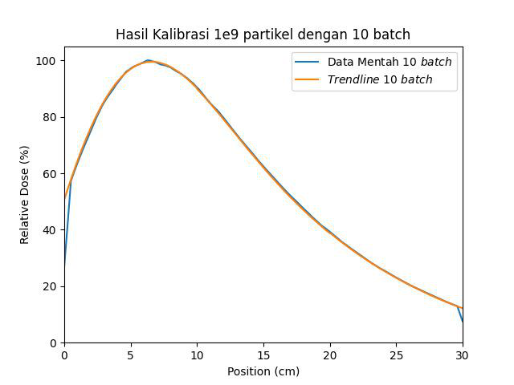 
 *Figure V.2. Percent Depth Dose (PDD) of the Water Phantom Calibration Simulation at 10 batches*

In the calibration measurement using a larger number of batches, that curve shows the dose peak at a different distance. This occurs because the geometry used to produce the LINAC beam does not resemble the real LINAC geometry. The peak in the batch is approximately at a depth of 6.1 cm. This is quite far when compared with the experimental results or Monte Carlo simulation with the actual geometry.

### V.1.2. Geometry

The geometry was created using functions available in Python; the geometry was created on the xy, yz, and xz axes. Simply put, it can be described that the room consists of primary walls on both side faces and a corridor on one of the other sides. This is in accordance with the floor plan available in Figure V.3. In that geometry, the gray color means the concrete wall of the room. The yellow color represents the iron layer in the wall. There is also a tally detector illustrated in dark blue. The light blue color is the box source used to produce the photon radiation.

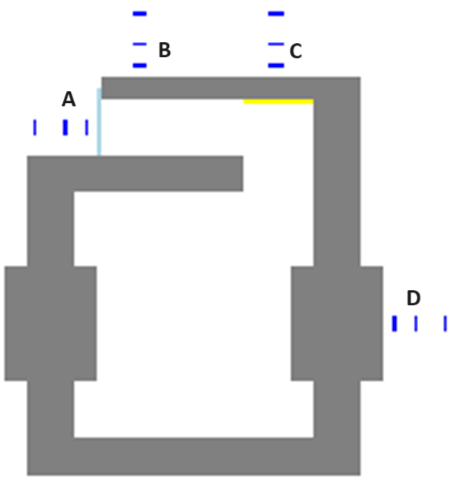 
 *Figure V.3. Geometry of the simulated LINAC room in the XY perception*

 
 *Figure V.4. Geometry of the simulated LINAC room in the YZ perception*

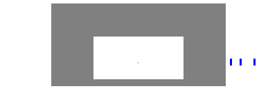 
 *Figure V.5. Geometry of the simulated LINAC room in the XZ perception*

### V.1.3. Per-Angle Dose Distribution Map

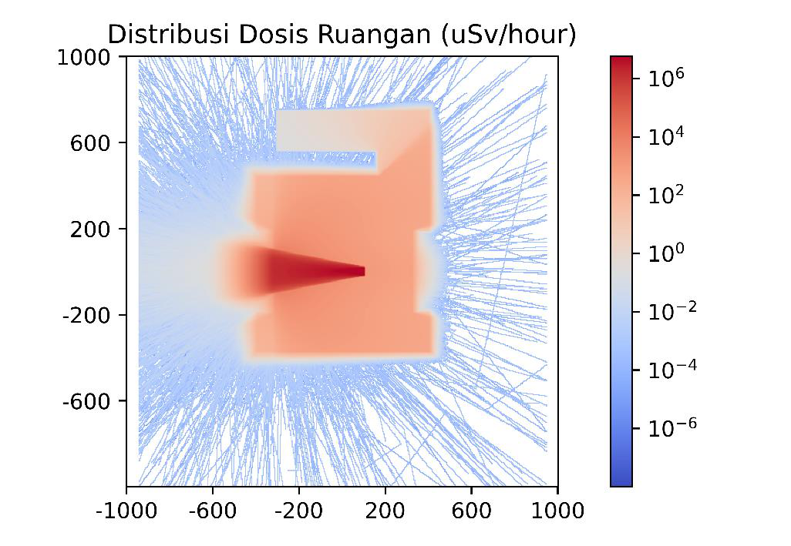 
 *Figure V.6. Heatmap of the Default Simulation Dose Distribution*

It can be seen that in the original heatmap output in Figure V.6, there is no significant radiation around the room except from the primary wall that is directly struck by the LINAC radiation. This dose distribution is formed using a grid function spread throughout that bunker. It can be seen that significant dose occurs in accordance with the direction of irradiation of the LINAC head. Meanwhile, in its surroundings, the detected dose is not very significant. The simulation was run with 1,000,000,000 particles in 3 batches. The white color in the room means that the number of particles in that simulation is still insufficient and needs to be increased. This is because a larger number of particles will be able to produce more accurate results in areas of the room with too small a dose. In Figures V.6 through V.9, the geometry is combined with the heatmap so that interpretation can be done more easily.

Using the geometry created previously and the dose heatmap from the simulation, a visualization of the bunker dose distribution can be made. At the 0° dose, with the LINAC beam directed toward the floor, the radiation reflection spreads throughout the room. This makes the dose rate at this angle significantly larger than at the other irradiation angles. The dose at this angle is also more accurate, because each point receives the dose rate from various angles until all points around the bunker are filled.

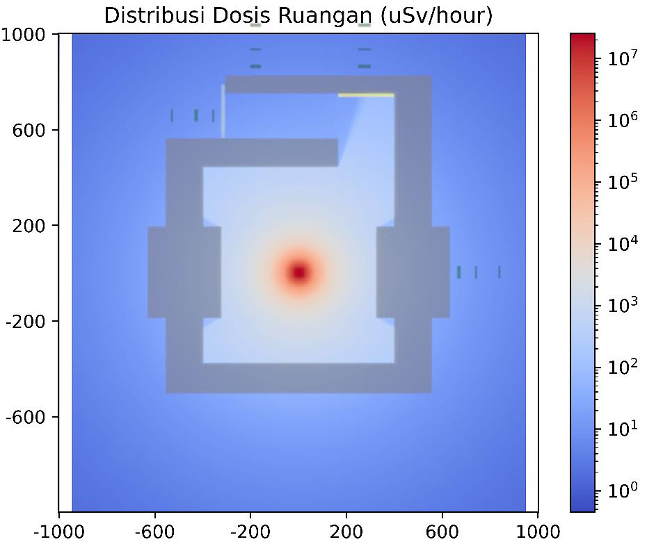 
 *Figure V.7. Dose Distribution at gantry 0° (Bottom)*

The same cannot be said for irradiation at the other angles. It can be seen that the dose for irradiation at the other angles is not yet sufficiently comprehensive to fill the grid tally in that angle's simulation. A simple analytical calculation can prove that every point around the bunker should have a radiation dose. Meanwhile, based on these irradiation images, it can be seen that there are tallies that do not receive any dose at all. An increase in the number of particles is greatly needed at the other angles. The dose rate at 270° and 90° is only significant toward the other bunker, while at 180° the distribution is directed toward the inaccessible roof.

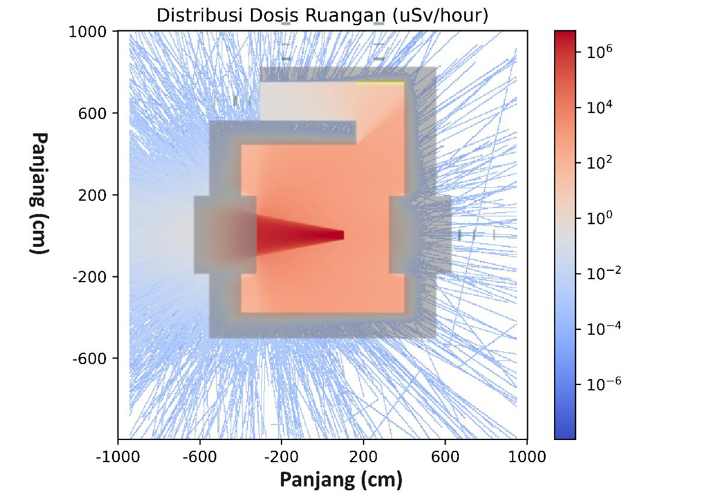 
 *Figure V.8. Dose Distribution at gantry 90°*

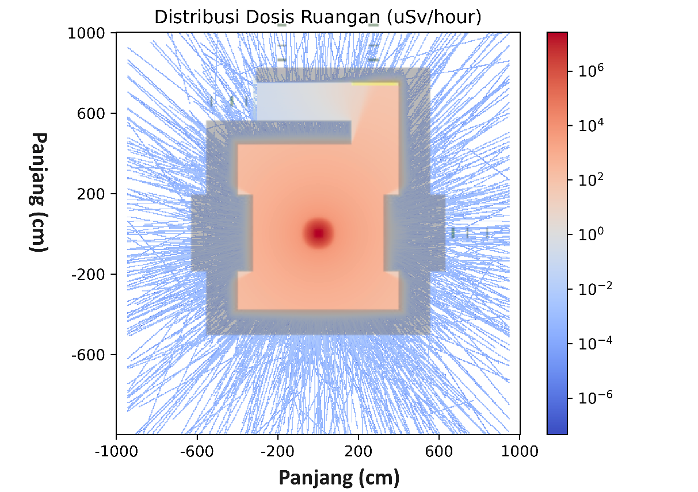 
 *Figure V.9. Dose Distribution at gantry 180° (Top)*

The dose rate at angles other than 0° shows empty points in that simulation. This can be remedied by increasing the number of particles by the amount of the order decrease in the dose rate around the bunker room. The dose rate around the room at those angles is on the order of -4, whereas at the order of -3 the radiation can already fill the simulation visualization. From this, it can be determined that the required increase in the number of particles is on the order of tens of times. This increase could be from 1x10¹⁰ up to 9x10¹⁰ particles. Using the computer specifications in this research, this could take 20 to 180 days. Therefore, an improvement in computer specifications needs to be made.

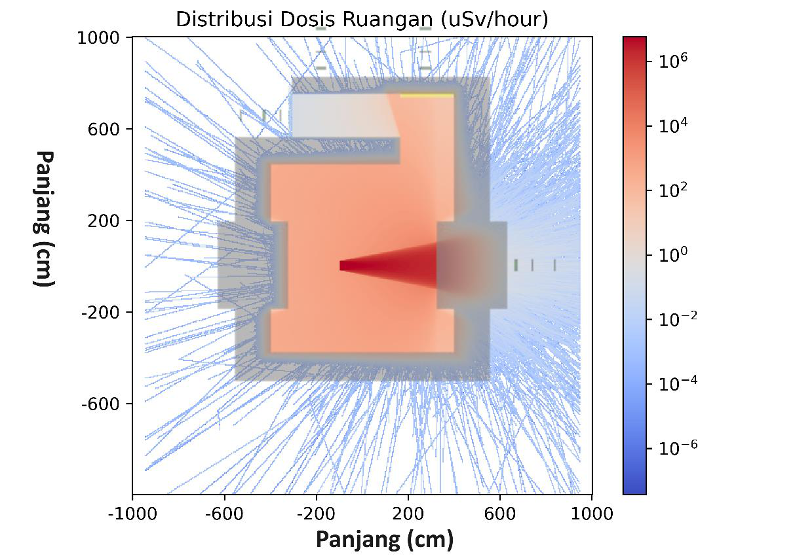 
 *Figure V.10. Dose Distribution at gantry 270°*

## V.2. Comparison of Dose Limits and Simulation Results

The dose rate obtained at the mounted tallies yielded the results shown in Table V.1. It can be seen that the dose is significantly larger at the 0° angle. This is what makes the grid tally appear full at that angle.

**Table V.1. Dose Rate Results Table**

| Point | Location | Distance to Wall (cm) | Simulation Dose Rate (μSv/hour) 0° | 90° | 180° | 270° |
|-------|----------|------|--------|--------|--------|--------|
| A | Front of Bunker Door | 30 | 5.71×10⁻³ | 1.31×10⁻³ | 2.15×10⁻³ | 2.00×10⁻⁴ |
| A | Front of Bunker Door | 100 | 3.35×10⁻³ | 9.10×10⁻⁴ | 0.00 | 6.37×10⁻⁴ |
| A | Front of Bunker Door | 200 | 1.20×10⁻² | 3.83×10⁻⁴ | 7.86×10⁻⁴ | 5.63×10⁻⁴ |
| B | LINAC Control Room | 30 | 2.07×10⁻² | 6.64×10⁻⁴ | 1.67×10⁻³ | 6.80×10⁻⁴ |
| B | LINAC Control Room | 100 | 4.00×10⁻² | 3.55×10⁻⁴ | 1.93×10⁻⁴ | 2.40×10⁻⁴ |
| B | LINAC Control Room | 200 | 5.32×10⁻² | 2.68×10⁻⁴ | 1.93×10⁻⁴ | 2.04×10⁻⁴ |
| C | TPS Room | 30 | 1.87×10⁻² | 6.64×10⁻⁴ | 1.55×10⁻⁴ | 0.00 |
| C | TPS Room | 100 | 2.90×10⁻² | 3.49×10⁻⁴ | 1.22×10⁻³ | 7.00×10⁻⁴ |
| C | TPS Room | 200 | 4.81×10⁻² | 5.66×10⁻⁴ | 1.23×10⁻³ | 6.93×10⁻⁴ |
| D | Bunker LINAC Precise | 30 | 5.47×10⁻² | 7.58×10⁻⁴ | 2.51×10⁻³ | 3.20×10⁻¹ |
| D | Bunker LINAC Precise | 100 | 6.37×10⁻² | 6.70×10⁻⁴ | 3.30×10⁻² | 2.48×10⁻¹ |
| D | Bunker LINAC Precise | 200 | 9.93×10⁻² | 3.76×10⁻⁴ | 1.81×10⁻⁴ | 2.20×10⁻¹ |

Based on the dose-rate measurement in Table V.1, it can be seen that the radiation dose does not always decrease the farther the detection is performed. This is because the radiation passing through the farthest detector can be done by radiation that does not arrive perpendicular to the wall. At 180° and 270°, there are detectors not passed by radiation at all.

The dose produced is already very low, considering that the LINAC is only operated a few times each day. Using the workload assumption used to calculate the LINAC thickness, the total operating time of the LINAC can be calculated. This calculation is performed with the assumption that the maximum irradiation dose rate is used. The workload calculation can be computed comprehensively based on Table V.2. The workload calculation in the analytical calculation for the secondary wall is performed by considering the coefficient factor Q. This differs from the primary analytical calculation, which does not use that factor.

**Table V.2. Weekly Workload Calculation**

| Type of Irradiation | Number of Patients (people) | Dose per patient (Gy/patient) | Operating Days (days/week) | Total Dose (Gy/week) |
|---------------------|-------------|-------------|-------------|-------------|
| Conventional | 20 | 4 | 5 | 400 |
| IMRT | 50 | 4 | 5 | 1000 |
| VMAT | 10 | 4 | 5 | 200 |
| QA | 12 | 2 | 6 | 144 |
| **Total Workload (Gy/week)** | | | | **1744** |
| **LINAC Operating Time (hours/week)** | | | | **4.84** |

At each of those walls, the applicable dose limit is the workers' dose constraint. This is because every room around the bunker is a workers' room and cannot be entered by the general public. The dose constraint for radiation workers according to BAPETEN Regulation (Perka) No. 4 of 2013 is 200 μSv/week.

**Table V.3. Dose Rate at LINAC Irradiation 0°**

| Point | Location | Distance to Wall (cm) | Dose Rate (μSv/hour) | Dose Rate per week (μSv/week) | Utility Dose Rate (μSv/week) |
|-------|----------|------|--------|--------|--------|
| A | Front of Bunker Door | 30 | 5.71×10⁻³ | 2.77×10⁻² | 8.58×10⁻³ |
| A | Front of Bunker Door | 100 | 3.35×10⁻³ | 1.62×10⁻² | 5.03×10⁻³ |
| A | Front of Bunker Door | 200 | 1.20×10⁻² | 5.83×10⁻² | 1.81×10⁻² |
| B | LINAC Control Room | 30 | 2.07×10⁻² | 1.00×10⁻¹ | 3.11×10⁻² |
| B | LINAC Control Room | 100 | 4.00×10⁻² | 1.94×10⁻¹ | 6.00×10⁻² |
| B | LINAC Control Room | 200 | 5.32×10⁻² | 2.58×10⁻¹ | 8.00×10⁻² |
| C | TPS Room | 30 | 1.87×10⁻² | 9.07×10⁻² | 2.81×10⁻² |
| C | TPS Room | 100 | 2.90×10⁻² | 1.40×10⁻¹ | 4.35×10⁻² |
| C | TPS Room | 200 | 4.81×10⁻² | 2.33×10⁻¹ | 7.23×10⁻² |
| D | Bunker LINAC Precise | 30 | 5.47×10⁻² | 2.65×10⁻¹ | 8.21×10⁻² |
| D | Bunker LINAC Precise | 100 | 6.37×10⁻² | 3.08×10⁻¹ | 9.56×10⁻² |
| D | Bunker LINAC Precise | 200 | 9.93×10⁻² | 4.81×10⁻¹ | 1.49×10⁻¹ |

**Table V.4. Dose Rate at LINAC Irradiation 90°**

| Point | Location | Distance to Wall (cm) | Dose Rate (μSv/hour) | Dose per week (μSv/week) | Utility Dose (μSv/week) |
|-------|----------|------|--------|--------|--------|
| A | Front of Bunker Door | 30 | 1.31×10⁻³ | 6.34×10⁻³ | 1.35×10⁻³ |
| A | Front of Bunker Door | 100 | 9.10×10⁻⁴ | 4.41×10⁻³ | 9.39×10⁻⁴ |
| A | Front of Bunker Door | 200 | 3.83×10⁻⁴ | 1.85×10⁻³ | 3.95×10⁻⁴ |
| B | LINAC Control Room | 30 | 6.64×10⁻⁴ | 3.22×10⁻³ | 6.86×10⁻⁴ |
| B | LINAC Control Room | 100 | 3.55×10⁻⁴ | 1.72×10⁻³ | 3.67×10⁻⁴ |
| B | LINAC Control Room | 200 | 2.68×10⁻⁴ | 1.30×10⁻³ | 2.76×10⁻⁴ |
| C | TPS Room | 30 | 6.64×10⁻⁴ | 3.22×10⁻³ | 6.86×10⁻⁴ |
| C | TPS Room | 100 | 3.49×10⁻⁴ | 1.69×10⁻³ | 3.60×10⁻⁴ |
| C | TPS Room | 200 | 5.66×10⁻⁴ | 2.74×10⁻³ | 5.84×10⁻⁴ |
| D | Bunker LINAC Precise | 30 | 7.58×10⁻⁴ | 3.67×10⁻³ | 7.82×10⁻⁴ |
| D | Bunker LINAC Precise | 100 | 6.70×10⁻⁴ | 3.24×10⁻³ | 6.91×10⁻⁴ |
| D | Bunker LINAC Precise | 200 | 3.76×10⁻⁴ | 1.82×10⁻³ | 3.88×10⁻⁴ |

**Table V.5. Dose Rate at LINAC Irradiation 180° (Top)**

| Point | Location | Distance to Wall (cm) | Dose Rate (μSv/hour) | Dose per week (μSv/week) | Utility Dose (μSv/week) |
|-------|----------|------|--------|--------|--------|
| A | Front of Bunker Door | 30 | 2.15×10⁻³ | 1.04×10⁻² | 2.74×10⁻³ |
| A | Front of Bunker Door | 100 | 0.00 | 0.00 | 0.00 |
| A | Front of Bunker Door | 200 | 7.86×10⁻⁴ | 3.81×10⁻³ | 1.00×10⁻³ |
| B | LINAC Control Room | 30 | 1.67×10⁻³ | 8.09×10⁻³ | 2.13×10⁻³ |
| B | LINAC Control Room | 100 | 1.93×10⁻⁴ | 9.33×10⁻⁴ | 2.45×10⁻⁴ |
| B | LINAC Control Room | 200 | 1.93×10⁻⁴ | 9.33×10⁻⁴ | 2.45×10⁻⁴ |
| C | TPS Room | 30 | 1.55×10⁻⁴ | 7.51×10⁻⁴ | 1.97×10⁻⁴ |
| C | TPS Room | 100 | 1.22×10⁻³ | 5.92×10⁻³ | 1.56×10⁻³ |
| C | TPS Room | 200 | 1.23×10⁻³ | 5.95×10⁻³ | 1.56×10⁻³ |
| D | Bunker LINAC Precise | 30 | 2.51×10⁻³ | 1.21×10⁻² | 3.19×10⁻³ |
| D | Bunker LINAC Precise | 100 | 3.30×10⁻² | 1.60×10⁻¹ | 4.20×10⁻² |
| D | Bunker LINAC Precise | 200 | 1.81×10⁻⁴ | 8.76×10⁻⁴ | 2.30×10⁻⁴ |

**Table V.6. Dose Rate at LINAC Irradiation 270°**

| Point | Location | Distance to Wall (cm) | Dose Rate (μSv/hour) | Dose per week (μSv/week) | Utility Dose (μSv/week) |
|-------|----------|------|--------|--------|--------|
| A | Front of Bunker Door | 30 | 2.00×10⁻⁴ | 9.67×10⁻⁴ | 2.06×10⁻⁴ |
| A | Front of Bunker Door | 100 | 6.37×10⁻⁴ | 3.09×10⁻³ | 6.57×10⁻⁴ |
| A | Front of Bunker Door | 200 | 5.63×10⁻⁴ | 2.73×10⁻³ | 5.81×10⁻⁴ |
| B | LINAC Control Room | 30 | 6.80×10⁻⁴ | 3.29×10⁻³ | 7.02×10⁻⁴ |
| B | LINAC Control Room | 100 | 2.40×10⁻⁴ | 1.16×10⁻³ | 2.48×10⁻⁴ |
| B | LINAC Control Room | 200 | 2.04×10⁻⁴ | 9.88×10⁻⁴ | 2.11×10⁻⁴ |
| C | TPS Room | 30 | 0.00 | 0.00 | 0.00 |
| C | TPS Room | 100 | 7.00×10⁻⁴ | 3.39×10⁻³ | 7.23×10⁻⁴ |
| C | TPS Room | 200 | 6.93×10⁻⁴ | 3.36×10⁻³ | 7.16×10⁻⁴ |
| D | Bunker LINAC Precise | 30 | 3.20×10⁻¹ | 1.55 | 3.30×10⁻¹ |
| D | Bunker LINAC Precise | 100 | 2.48×10⁻¹ | 1.20 | 2.56×10⁻¹ |
| D | Bunker LINAC Precise | 200 | 2.20×10⁻¹ | 1.07 | 2.27×10⁻¹ |

With the weekly LINAC operating time and the dose limit in accordance with the provisions of NCRP 151 and SRS 47, the safety of the bunker design can be assessed for compliance. That value is obtained by multiplying the total dose rate by the utility factor of each irradiation angle. Based on Table III.2, the utility is 31% at 0°, 21.3% at 90° and 270°, and 26.3% at 180°. The dose rate from the simulation at each angle is then multiplied by its respective utility so that it can then be summed to determine the expected worker dose at each studied point. This value is what can ultimately be compared to determine how small the dose received by workers at those points is compared with the applicable dose constraint. This is explained through Equation 4.7.

The dose rate from the measurement results at each angle is summed to find the dose rate on workers. The total of LINAC operation each week and the use of the occupancy factor to estimate the dose received by workers based on occupancy are shown in Table V.7.

**Table V.7. Total Expected Dose Rate on Workers in the Rooms**

| Point | Location | Occupancy Factor (T) | Distance to Wall (cm) | Total Dose (μSv/week) | Total Occupancy Dose (μSv/week) |
|-------|----------|------|------|--------|--------|
| A | Front of Bunker Door | 0.125 | 30 | 1.29×10⁻² | 1.61×10⁻³ |
| A | Front of Bunker Door | 0.125 | 100 | 6.62×10⁻³ | 8.28×10⁻⁴ |
| A | Front of Bunker Door | 0.125 | 200 | 2.01×10⁻² | 2.51×10⁻³ |
| B | LINAC Control Room | 1 | 30 | 3.46×10⁻² | 3.46×10⁻² |
| B | LINAC Control Room | 1 | 100 | 6.09×10⁻² | 6.09×10⁻² |
| B | LINAC Control Room | 1 | 200 | 8.07×10⁻² | 8.07×10⁻² |
| C | TPS Room | 1 | 30 | 2.90×10⁻² | 2.90×10⁻² |
| C | TPS Room | 1 | 100 | 4.62×10⁻² | 4.62×10⁻² |
| C | TPS Room | 1 | 200 | 7.52×10⁻² | 7.52×10⁻² |
| D | Bunker LINAC Precise | 0.5 | 30 | 4.16×10⁻¹ | 2.08×10⁻¹ |
| D | Bunker LINAC Precise | 0.5 | 100 | 3.94×10⁻¹ | 1.97×10⁻¹ |
| D | Bunker LINAC Precise | 0.5 | 200 | 3.77×10⁻¹ | 1.88×10⁻¹ |

The dose delivered by the LINAC at those points is much smaller than its dose limit value of 200 μSv/week. This value is 961 to 242,000 times smaller than the applicable NBD. It should be noted that the dose target for each bunker is at the bunker wall, whereas the dose study is performed at distances of 30 cm, 100 cm, and 200 cm. These locations are the locations more likely to be occupied by radiation workers when irradiation is performed.

In the design of the bunker room, the addition of a thickness equal to the half value layer (HVL) is also performed after the minimum wall thickness is obtained. This is then followed by rounding up the dimensions of the concrete wall. Therefore, the inverse square law and the attenuation factor play a major role in the dose rate being many times smaller than its dose limit value.

In this simulation, the LINAC characteristics are a simplification of real LINAC irradiation. The accuracy of the simulation results can be improved by adding a flattening filter (FF), using a phase-space file, and increasing the number of particles.

---

# CHAPTER VI. CONCLUSIONS AND SUGGESTIONS

## VI.1. Conclusions

1. The simulated dose rate around the LINAC bunker ranges from 8.28×10⁻³ to 0.208 μSv/week. This value is far smaller than the dose constraint enforced by BAPETEN Regulation (Perka) No. 3 of 2013. This means that the bunker's safety already complies with the applicable standard.

2. A visualization of the dose-rate distribution in the bunker room was obtained to help interpret the dose occurring at each dose-rate measurement point around the bunker.

## VI.2. Suggestions

There are things that can be developed in carrying out this research. An improvement in the accuracy of the simulation results can be achieved by adding a flattening filter (FF), using a phase-space file, and increasing the number of particles. The use of a computer with higher specifications can also be employed in order to simulate a larger number of particles.

---

# REFERENCES

[1] P. D. S. O. P.O.R.I, "Program Kerja Perhimpunan Dokter Spesialis Onkologi Radiasi 2018-2021," pp. 1-24, 2018.

[2] COCIR, "Radiotherapy age profile & density," no. December, 2019.

[3] Badan Pengawas Tenaga Nuklir, "Peraturan Kepala Badan Pengawas Tenaga Nuklir Nomor 4 Tahun 2013 tentang Proteksi dan Keselamatan Radiasi Dalam Pemanfaatan Tenaga Nuklir," 2013.

[4] IAEA, "IAEA Safety Reports Series No. 47 - Radiation Protection in the Design of Radiotherapy Facilities," Saf. Reports Ser., vol. 47, p. 9, 2006, [Online]. Available: https://www-pub.iaea.org/MTCD/publications/PDF/Pub1223_web.pdf

[5] NCRP, "Structural Shielding Design and Evaluation for Megavoltage X and Gamma Ray Radiotherapy Facilities," Maryland, 2005.

[6] M.Yu. Tikhonchev, G.A. Shimansky, E.E. Lebedeva, V. V. Lichadeev, D. K. Ryazanov, and A.I. Tellin, "The Role of Computer Simulation in Nuclear Technologies Development," Res. Inst. At. React., 2000.

[7] A. S. Ferdiansyah, "Evaluasi Keselamatan Radiasi pada Dinding Gedung Linear Accelerator (LINAC) Versa HD di Rumah Sakit Umum Pusat Dr. Sardjito," Skripsi, Departemen Teknik Nuklir dan Teknik Fisika, Fakultas Teknik, Universitas Gadjah Mada, 2022.

[8] Y. M. Dinata, "Pengukuran Paparan Radiasi di Luar Bungker LINAC Radiotherapy Rumah Sakit Dr. Sardjito Yogyakarta," Thesis, Departemen Teknik Nuklir dan Teknik Fisika, Fakultas Teknik, Universitas Gadjah Mada, 2010.

[9] A. Rafi, "Desain Dinding Perisai Radiasi Ruangan Hot Laboratory pada Instalasi Kedokteran Nuklir Menggunakan Program Monte Carlo N-Particle Extended," Skripsi, Departemen Teknik Nuklir dan Teknik Fisika, Fakultas Teknik, Universitas Gadjah Mada, 2018.

[10] N. K. T. Kusnaedi, "Analisis Ketebalan dan Material pada Perisai Radiasi Ruang Siklotron 30 MeV untuk BNCT menggunakan Program Particle and Heavy Ion Transport Code System (PHITS)," Skripsi, Departemen Teknik Nuklir dan Teknik Fisika, Fakultas Teknik, Universitas Gadjah Mada, 2023.

[11] A.R. Priadi, "Evaluasi Desain Ruangan Linear Accelerator (LINAC) 10 MV di Rumah Sakit JIH Yogyakarta Menggunakan OpenMC," Skripsi, Departemen Teknik Nuklir dan Teknik Fisika, Fakultas Teknik, Universitas Gadjah Mada, 2022.

[12] M. A. Efendi, A. Funsian, T. Chittrakarn, and T. Bhongsuwan, "Monte Carlo simulation using PRIMO code as a tool for checking the credibility of commissioning and quality assurance of 6 MV TrueBeam STx varian LINAC," Reports Pract. Oncol. Radiother., vol. 25, no. 1, pp. 125-132, 2020, doi: 10.1016/j.rpor.2019.12.021.

[13] N. Tsoulfanidis, Measurement and Detection of Radiation. Boca Raton: CRC Press, 2010. doi: 10.1201/9781439894651.

[14] Glenn F. Knoll, Radiation detection and measurement, 4th ed. Hoboken, N.J: JOHN WILEY, 2020. doi: 10.1134/S1063778819090060.

[15] J. E. Martin, Physics for Radiation Protection. Weinheim: Wiley, 2013. doi: 10.1002/9783527667062.

[16] K. S. Krane and W. G. Lynch, "Introductory Nuclear Physics," Phys. Today, vol. 42, no. 1, pp. 78-78, Jan. 1989, doi: 10.1063/1.2810884.

[17] H. Cember and J. E. Turner, "Introduction to Health Physics. Second Edition," Phys. Today, vol. 37, no. 9, pp. 78-79, Sep. 1984, doi: 10.1063/1.2916417.

[18] G. J. Kutcher et al., "Comprehensive QA for radiation oncology: Report of AAPM Radiation Therapy Committee Task Group 40," Med. Phys., vol. 21, no. 4, pp. 581-618, Apr. 1994, doi: 10.1118/1.597316.

[19] "Dokumen Perhitungan Tebal Dinding Penahan Radiasi Ruang Pesawat LINAC Elekta Synergy Instalasi Radioterapi RSUP Dr. Hasan Sadikin".

[20] A. W. Harto, Dasar-Dasar Fisika Akselerator. Sleman: UGM Press, 2023.

[21] M. Hossain, "Output trends, characteristics, and measurements of three megavoltage radiotherapy linear accelerators," J. Appl. Clin. Med. Phys., vol. 15, no. 4, pp. 137-151, Jul. 2014, doi: 10.1120/jacmp.v15i4.4783.

[22] F. Van den Heuvel, Q. Wu, and J. Cai, "In modern linacs monitor units should be defined in water at 10 cm depth rather than at d max," Med. Phys., vol. 45, no. 11, pp. 4789-4792, Nov. 2018, doi: 10.1002/mp.13015.

[23] Y. Zhang, Y. Feng, X. Ming, and J. Deng, "Energy Modulated Photon Radiotherapy: A Monte Carlo Feasibility Study," Biomed Res. Int., vol. 2016, pp. 1-16, 2016, doi: 10.1155/2016/7319843.

[24] M. Rianna, H. A. Sianturi, H. Lubis, A. Pelawi, T. Sembiring, and M. Situmorang, "Comparison of Energy Doses 10 Mv Distribution Using Percentage Depth Dose (Pdd) Method on Linac: Electa and Siemens," J. Nat., vol. 18, no. 2, pp. 85-88, 2018, doi: 10.24815/jn.v18i2.11133.

[25] Clement C. H. and Petoussi-Henss N., "ICRP Publication 116 Conversion Coefficients for Radiological Protection Quantities for External Radiation Exposures," Ann. ICRP, 2012, doi: 10.1016/0146-6453(81)90127-5.

[26] P. K. Romano, "Openmc.data.dose_coefficients." [Online]. Available: https://openmc.discourse.group/t/openmc-data-dose-coefficients/1634


---

# APPENDICES

*The following appendices (LAMPIRAN A-G) contain the OpenMC program listings, commissioning dose-rate measurements, analytical bunker-design calculations, and the ICRP 116 flux-to-dose conversion tables. They are reproduced verbatim from the original thesis.*

```text
                             LAMPIRAN A
                      Listing Program OpenMC

                   Pemanggilan cross section ENDF
Export          OPENMC_CROSS_SECTIONS='/home/sena/Code/endfb-vii.1
hdf5/cross_sections.xml'

# export OPENMC_CROSS_SECTIONS=$var/cross_sections.xml

export HDF5_DISABLE_VERSION_CHECK=1

                          Program Kalibrasi
import openmc

# vim:foldmethod=marker

import openmc

import matplotlib.pyplot as plt

import openmc.stats, openmc.data

from math import cos, atan2, pi


batches = 10

inactive = 10

particles = int(input('Enter number of particle (It was 1e8)\n= '))
#1_000_000_000


# Material

# {{{

air=openmc.Material(name='Air')

air.set_density('g/cm3',0.001205)

air.add_nuclide('N14',0.7)

air.add_nuclide('O16',0.3)

#air.add_s_alpha_beta('c_H_in_Air')

air.add_element('C',0.002)

air.add_element('Fe',0.001)

air.add_element('Si',0.001)

air.add_element('Mn',0.001)


                                   43
water=openmc.Material(name='Water')

water.set_density('g/cm3',1.0)

water.add_nuclide('H1',2.0)

water.add_nuclide('O16',1.0)

water.add_s_alpha_beta('c_H_in_H2O')


water2=openmc.Material(name='Water')

water2.set_density('g/cm3',1.0)

water2.add_nuclide('H1',2.0)

water2.add_nuclide('O16',1.0)

water2.add_s_alpha_beta('c_H_in_H2O')


materials = openmc.Materials( [air,water,water2])

materials.export_to_xml()

# }}}


SSD = 100.0 #Source to Skin Distance

PHANTOM_WIDTH = 40

ld= 0.1# panjang dan lebar WP

d = 30.0 #kedalaman WP

padd = 10.0 #padding terhadap source dan detektor


# {{{


n = 300

phantom_cells = []

dx = d/n

for i in range(n):

  x0 = SSD + i*dx

  x1 = SSD +(i+1)*dx

  r_x = +openmc.XPlane(x0) & -openmc.XPlane(x1)


                                  44
  r_y = +openmc.YPlane(-ld/2.0) & -openmc.YPlane(ld/2.0)

  r_z = +openmc.ZPlane(-ld/2.0) & -openmc.ZPlane(ld/2.0)


  cell = openmc.Cell(region=r_x & r_y & r_z)

  cell.fill = water2

  phantom_cells.append(cell)


r_x = +openmc.XPlane(SSD) & -openmc.XPlane(SSD+d)

r_y = +openmc.YPlane(-ld/2.0) & -openmc.YPlane(ld/2.0)

r_z = +openmc.ZPlane(-ld/2.0) & -openmc.ZPlane(ld/2.0)

r_phantally = r_x & r_y & r_z


r_y_wp= +openmc.YPlane(-PHANTOM_WIDTH/2.0)\

  & -openmc.YPlane(PHANTOM_WIDTH/2.0)

r_z_wp= +openmc.ZPlane(-PHANTOM_WIDTH/2.0)\

  & -openmc.ZPlane(PHANTOM_WIDTH/2.0)

r_wp= r_x & r_y_wp & r_z_wp

c_wp= openmc.Cell(region=r_wp& ~r_phantally)

c_wp.fill = water


r_x_air = +openmc.XPlane(-padd, boundary_type='vacuum')\

  & -openmc.XPlane(SSD+d+padd, boundary_type='vacuum')

r_y_air          =            +openmc.YPlane(-PHANTOM_WIDTH/2.0-padd,
boundary_type='vacuum')\

  & -openmc.YPlane(PHANTOM_WIDTH/2.0+padd, boundary_type='vacuum')

r_z_air          =            +openmc.ZPlane(-PHANTOM_WIDTH/2.0-padd,
boundary_type='vacuum')\

  & -openmc.ZPlane(PHANTOM_WIDTH/2.0+padd, boundary_type='vacuum')

r_air = r_x_air & r_y_air & r_z_air

c_air = openmc.Cell(region=r_air & ~r_wp)

c_air.fill = air


universe = openmc.Universe(cells= [c_air]+phantom_cells+ [c_wp])


                                  45
geometry = openmc.Geometry()

geometry.root_universe = universe

geometry.export_to_xml()

# }}}

plot= openmc.Plot()

plot.basis = 'yz'

plot.filename='yz_cal'

plot.origin = (110, 0, 0)

plot.width = (50., 50.)

plot.pixels=(1000,1000)

plot.color_by='material'

plot.colors={

    water:'blue',

    air:'green',

    water2:'black'

}

plot_file=openmc.Plots( [plot])

plot_file.export_to_xml()

openmc.plot_geometry()

plot.to_ipython_image()


plot.basis='xz'

plot.filename='xz_cal'

plot.width=(100,100)

plot.pixels=(1000,1000)

plot.origin=(100,0,0)

plot_file=openmc.Plots( [plot])

plot_file.export_to_xml()

openmc.plot_geometry()

plot.to_ipython_image()


                                  46
# {{{

batches= batches

inactive = inactive

particles = particles


particle_filter = openmc.ParticleFilter('photon')

# energy, dose = openmc.data.dose_coefficients('photon', 'AP')

energy, dose = openmc.data.dose_coefficients('photon', 'RLAT')

dose_filter = openmc.EnergyFunctionFilter(energy, dose)


#######    TALLIES      #########

tallies_file = openmc.Tallies()

cell_filter = openmc.CellFilter(phantom_cells)

tally = openmc.Tally(name='tally')

tally.filters = [cell_filter, particle_filter, dose_filter]

tally.scores = ['flux']


"""

#######    MESH TALLY       #########

tallysize=0.1

mesh = openmc.Mesh()

mesh.dimension = [1, 1, 400]

mesh.lower_left = [SSD, -tallysize/2, -FIELD_SIZE/2]#type: ignore

mesh.upper_right = [SSD+tallysize, tallysize/2, FIELD_SIZE/2]#type:
ignore

mesh_filter = openmc.MeshFilter(mesh)


tally01 = openmc.Tally(name="0 depth tally")

tally01.filters = [mesh_filter, particle_filter, dose_filter]

tally01.scores = ['flux']


meshdpp01 = openmc.Mesh()


                                    47
meshdpp01.dimension = [300, 1, 1]

meshdpp01.lower_left    =       [SSD,     -tallysize/2,     -tallysize/2]#type:
ignore

meshdpp01.upper_right       =    [SSD+d,     tallysize/2,   tallysize/2]#type:
ignore

meshdpp01_filter = openmc.MeshFilter(meshdpp01)


tallydpp01 = openmc.Tally(name="profile depth dose tally")

tallydpp01.filters          =      [meshdpp01_filter,         particle_filter,
dose_filter]

tallydpp01.scores = ['flux']


meshdpp5 = openmc.Mesh()

meshdpp5.dimension = [300, 1, 1]

meshdpp5.lower_left     =       [SSD,   -tallysize/2,       -tallysize/2]#type:
ignore

meshdpp5.upper_right    =       [SSD+d,      tallysize/2,   tallysize/2]#type:
ignore

meshdpp5_filter = openmc.MeshFilter(meshdpp5)


tallydpp5 = openmc.Tally(name="profile depth dose tally")

tallydpp5.filters = [meshdpp5_filter, particle_filter, dose_filter]

tallydpp5.scores = ['flux']


tallies_file.append(tallydpp01)

tallies_file.append(tallydpp5)

tallies_file.append(tally01)

"""

tallies_file.append(tally)

tallies_file.export_to_xml()


source = openmc.Source() #type: ignore

source.space = openmc.stats.Point((0,0,0))

phi = openmc.stats.Uniform(0, 2*pi)


                                        48
#mu = openmc.stats.Uniform(cos(atan2(l/2, SSD)), 1)

mu = openmc.stats.Uniform(cos(atan2(40/2, SSD)), 1)

source.angle                                                 =
openmc.stats.PolarAzimuthal(mu,phi,reference_uvw=(1,0,0))

source.energy = openmc.stats.Discrete( [10e6], [1]) #10MeV

source.particle = 'photon'


settings = openmc.Settings()

settings.batches = batches

settings.inactive = inactive

settings.particles = particles

settings.run_mode = 'fixed source'

settings.photon_transport = True

settings.export_to_xml()

# }}}


openmc.run()

                        Program Pembaca Kalibrasi
import openmc

import matplotlib.pyplot as plt

import numpy as np

from scipy.signal import savgol_filter

import matplotlib.ticker as mtick

##


sp = openmc.StatePoint('statepoint.5.h5')

##

print(sp.n_particles)


n = 300

d = 30


                                   49
tal = sp.tallies [1]

datay = tal.mean

# datax is linspace between 0 and 50

datax = np.linspace(0,d,n)

datay.shape = (n,)

# smooth datay

datay = np.convolve(datay, np.ones(10)/10, mode='same')

# find the index of the maximum value in datay

max_index = np.argmax(datay)

x_max = datax [max_index]

y_max = datay [datay.argmax()]

print(x_max,max_index,y_max)


y_max=datay [max_index]

plt.axvline(x=x_max, color='r')

plt.legend(loc='best')

plt.ylabel("Relative Dose (%)")

plt.xlabel("Position (cm)")

plt.xlim(0,30)

plt.ylim(0,105)

datay=datay/y_max*100

plt.plot(datax, datay)


tal = sp.tallies [1]

datay = tal.mean

datay=datay/y_max*100

n = len(datay)


x_smooth=datax

y_smooth = np.interp(x_smooth, datax, datay)

# print (f"datay =\n {datay}")

# print (f"ysmooth=\n{y_smooth}")


                                  50
# Apply Savitzky-Golay filter for smoothing

window_size = 200

poly_order =5

y_smooth = savgol_filter(y_smooth, window_size, poly_order)


max_index=np.argmax(y_smooth)

x_maxs = x_smooth [max_index]

y_maxs=y_smooth [max_index]

plt.plot(x_smooth, y_smooth)

plt.title(f'x_max = {x_max} cm \n xsmooth_max = {x_maxs} cm')

plt.savefig('pdd.png')

plt.show()

plt.savefig('pdd.png')

"""

tal = sp.tallies [2]

datay = tal.mean

# datax is linspace between 0 and 50

datax = np.linspace(0,d,n)

datay.shape = (n,)

# smooth datay

datay = np.convolve(datay, np.ones(10)/10, mode='same')

# find the index of the maximum value in datay

max_index = np.argmax(datay)

x_max = datax [max_index]

y_max = datay [datay.argmax()]

print(x_max,max_index,y_max)


y_max=datay [max_index]

#plt.axvline(x=x_max, color='r')

plt.legend(loc='best')

plt.ylabel("Relative Dose (%)")


                                   51
plt.xlabel("Position (cm)")

plt.xlim(-0,30)

plt.ylim(0,105)

datay=datay/y_max*100

plt.plot(datax, datay)


tal = sp.tallies [1]

datay = tal.mean

datay=datay/y_max*100

n = len(datay)


x_smooth=datax

y_smooth = np.interp(x_smooth, datax, datay)

# print (f"datay =\n {datay}")

# print (f"ysmooth=\n{y_smooth}")


# Apply Savitzky-Golay filter for smoothing

window_size = 200

poly_order =5

y_smooth = savgol_filter(y_smooth, window_size, poly_order)


max_index=np.argmax(y_smooth)

x_maxs = x_smooth [max_index]

y_maxs=y_smooth [max_index]

plt.plot(x_smooth, y_smooth)

# draw line at x_max

#plt.axvline(x=x_maxs, color='r')

# write x_max value on plot

plt.title(f'x_max = {x_max} cm \n xsmooth_max = {x_maxs} cm')

#print(f"Y Value on xmax={_max}")

plt.show()

plt.savefig('2.5 depth.png')


                                 52
def rounde(unrounded):

  roundede="{:.4e}".format(unrounded)

  return roundede


print(f"\nDosis = {rounde(y_max)}pSvcm3/src")

print(f"Dosis smoothen = {rounde(y_maxs)}pSvcm3/src\n")


print(f"s_rate=mu*volume_wp/phandosevalues") # mu=

mu=1e11#600 MU/min = 10 cGy/s = 1e11 pSv/s

volume_wp=(d/n)*6*6

wpdose=y_max

s_rate=mu*volume_wp/wpdose


print(f"s_rate={mu}*{volume_wp}/{rounde(wpdose)}={s_rate}")

#600cGy/min=36000cGy/h=36uSv/h

print(f"600 cgy/min = 36uSv/h")

print(f"\n36uSv/h = k * {y_max} pSvcm3/src/{volume_wp}cm3\n")

k=volume_wp/y_max*36

print(f"k      *      {y_max}          pSvcm3/src/{volume_wp}cm3   =
{k*y_max/volume_wp}uSv/h")

print(f"36 uSv/h = {k*y_max/volume_wp} uSv/h")

print(f"k = {k}")


print(f"k smoothen = {volume_wp/y_maxs*36}")


tally = sp.tallies [3]#2.5 depth {{{

import matplotlib.pyplot as plt


flux = tally.get_slice(scores= ['flux'])

data = tally.mean.flatten()


                                  53
x = np.linspace(-25, 25, len(data))


max_index=np.argmax(data)

x_max = x [max_index]

y_max = np.max(data)

print("ymax = ", y_max)

plt.axvline(x=x_max,color='r',label='peak')

yflat=data/y_max*100

#print(yflat)


fmt='%.0f%%' #changing into format

xticks = mtick.FormatStrFormatter(fmt)


#plt.yflat.set_major_formatter(FuncFormatter(lambda     y,     _:
'{:.0%}'.format(yflat)))

plt.plot(x, yflat,label="raw")


ysmooth=np.interp(x,x,yflat)

window_size=300

poly_order=10

start=100

end=400

area_tofilter=yflat [start:end]

filtered=savgol_filter(area_tofilter,window_size,poly_order)

ysmooth [start:end]=filtered

plt.plot(x,ysmooth,label="savgol filter")

plt.legend(loc='best')

plt.ylabel("Relative Dose (%)")

plt.xlabel("Position (cm)")

plt.xlim(-25,25)

plt.ylim(0,105)


                                  54
plt.title('2.5 depth.png')

plt.savefig('2.5 depth.png')

plt.show()

"""


                         Program Ruangan
import openmc #type: ignore

import matplotlib.pyplot as plt

from math import * #type: ignore


particle=int(input('Particle number (\'twas 1e7)\n= '))

SOURCE_SIZE=20

FIELD_SIZE=40

SSD=100


air=openmc.Material(name='Air')

air.set_density('g/cm3',0.001205)

air.add_nuclide('N14',0.7)

air.add_nuclide('O16',0.3)

#air.add_s_alpha_beta('c_H_in_Air')

air.add_element('C',0.002)

air.add_element('Fe',0.001)

air.add_element('Si',0.001)

air.add_element('Mn',0.001)


air2=openmc.Material(name='Air')

air2.set_density('g/cm3',0.001205)

air2.add_nuclide('N14',0.7)

air2.add_nuclide('O16',0.3)

#air.add_s_alpha_beta('c_H_in_Air')

air2.add_element('C',0.002)


                                   55
air2.add_element('Fe',0.001)

air2.add_element('Si',0.001)

air2.add_element('Mn',0.001)


water=openmc.Material(name='Water')

water.set_density('g/cm3',1.0)

water.add_nuclide('H1',2.0)

water.add_nuclide('O16',1.0)

water.add_s_alpha_beta('c_H_in_H2O')


soft=openmc.Material(name='Soft Tissue')

soft.set_density('g/cm3',1.0)

soft.add_element('H', 10.4472, percent_type='ao')#1

soft.add_element('C', 23.219, percent_type='ao')#6

soft.add_element('N', 2.388, percent_type='ao')#7

soft.add_element('O', 63.0238, percent_type='ao')#8

soft.add_element('Na', 0.113, percent_type='ao')#11

soft.add_element('Mg', 0.013, percent_type='ao')#12

soft.add_element('S', 0.199, percent_type='ao')#16

soft.add_element('Cl', 0.134, percent_type='ao')#17

soft.add_element('K', 0.199, percent_type='ao')#19

soft.add_element('Ca', 0.023, percent_type='ao')#20

#https://physics.nist.gov/cgi-bin/Star/compos.pl?matno=261


bpe=openmc.Material(name='Borate Polyethylene')

bpe.set_density('g/cm3',1.0)

bpe.add_element('H', 0.111, percent_type='ao')#1

bpe.add_element('C', 0.856, percent_type='ao')#6

bpe.add_element('B', 0.143, percent_type='ao')#5

bpe.add_element('O', 0.889, percent_type='ao')#8


lead=openmc.Material(name='Lead')


                                 56
lead.set_density('g/cm3',11.35)

lead.add_element('Pb',1.0)


concrete=openmc.Material(name='Concrete')

concrete.set_density('g/cm3',2.3)      #Harus   disesuaikan   dengan   uji
beton

concrete.add_element('H', 0.01, percent_type='ao')#1

concrete.add_element('C', 0.01, percent_type='ao')#6

concrete.add_element('O', 0.52, percent_type='ao')#8

concrete.add_element('Na', 0.01, percent_type='ao')#11

concrete.add_element('Mg', 0.01, percent_type='ao')#12

concrete.add_element('Al', 0.01, percent_type='ao')#13

concrete.add_element('Si', 0.25, percent_type='ao')#14

concrete.add_element('S', 0.01, percent_type='ao')#16

concrete.add_element('K', 0.01, percent_type='ao')#19

concrete.add_element('Ca', 0.01, percent_type='ao')#20

concrete.add_element('Fe', 0.01, percent_type='ao')#26

concrete.add_element('Pb', 0.01, percent_type='ao')#82


iron = openmc.Material(name="Iron")

iron.set_density('g/cm3',7.87) #Harus disesuaikan dengan uji beton

iron.add_element('Fe', 1.0)#1


materials=openmc.Materials(
[air,air2,air3,water,soft,bpe,lead,concrete,iron])

materials.export_to_xml()


################################################

rotationDegree=int(input("Harap masukkan sudut rotasi LINAC\n= "))

############# Geometry ########################

#x

t1=openmc.XPlane(632)

t2=openmc.XPlane(632-76.5)


                                  57
t3=openmc.XPlane(632-76.5-155)

t3fe=openmc.XPlane(632-76.5-155-235)

t4=openmc.XPlane(632-76.5-155-76.5)

t5=openmc.XPlane(632-76.5-155-76.5)

t6=openmc.XPlane(632-76.5-155-235)


b1=openmc.XPlane(-632)

b2=openmc.XPlane(-632+76.5)

b3=openmc.XPlane(-632+76.5+155.0)

b4=openmc.XPlane(-632+76.5+155.0+76.5)

b5=openmc.XPlane(-632+76.5+250.5)


#y #Di berkas 125, tapi ga make sense jadi diubah ke 1200 biar masuk
angkanya

u1=openmc.YPlane(190.0+250.0+120.0+185.0+81.0)

u2=openmc.YPlane(190.0+250.0+120.0+185.0)

ufe=openmc.YPlane(190.0+250.0+120.0+185.0-10)

u3=openmc.YPlane(190.0+250.0+120.0)

u4=openmc.YPlane(190.0+250.0)

u5=openmc.YPlane(190.0)


s1=openmc.YPlane(-190.0-185.0-128.0)

s2=openmc.YPlane(-190.0-185.0)

s3=openmc.YPlane(-190.0)


#z total tinggi = 6000, lantai 1 setebal 480


zm1=openmc.ZPlane(-300.0)

zmax=openmc.ZPlane(300.0)

z3=openmc.ZPlane(-300.0+48.0+124.0+186.0+117.0+125.0)#1250      ATO
2500???

z2=openmc.ZPlane(-300.0+48.0+124.0+186.0+117.0)

z1=openmc.ZPlane(-300.0+48.0+124.0+186.0)


                                 58
z0=openmc.ZPlane(-300.0+48.0)


#pintu utara, pintu barat, pintu selatan geometri nya

pu=openmc.YPlane(190.0+250.0+120.0+185.0+40.0)

#                   ^^^ asumsi pintu lebih lebar 40cm dibandingkan
lubang pintunya

pb0=b5

pb1=openmc.XPlane(-632.0+76.5+250.5-1) #Angkanya ini masih ngarang
karena gatau tebal pintu, ada kemungkinan formulanya di RHSPintu.py
salah

pb2=openmc.XPlane(-632.0+76.5+250.5-1-15)

pb3=openmc.XPlane(-632.0+76.5+250.5-1-15-1)

ps=u3


###############################################

dt1 = -t1 & +t2 & +s3 & -u5 & +z0 & -z2

dt2 = -t2 & +t3 & +s1 & -u1 & +z0 & -z2

dt3 = -t3 & +t4 & +s3 & -u5 & +z0 & -z2


db1 = +b1 & -b2 & +s3 & -u5 & +z0 & -z2

db2 = +b2 & -b3 & +s1 & -u3 & +z0 & -z2

db3 = +b3 & -b4 & +s3 & -u5 & +z0 & -z2


du1 = +b5 & -t3 & -u1 & +u2 & +z0 & -z2

du2 = +b3 & -t6 & -u3 & +u4 & +z0 & -z2


ds1 = +b3 & -t3 & +s1 & -s2 & +z0 & -z2


fe1 = -t3 & +t3fe & -u1 & +ufe & +z0 & -z2

datas= +b1 & -t1 & +s1 & -u1 & +z2 & -z3 #celing

datte= +b4 & -t4 & -u5 & +s3 & +z1 & -z2 #linac's middle wall

dbaw = +b1 & -t1 & +s1 & -u1 & +zm1 & -z0 #flooring


                                59
###############################################

#pintu

ppb = -pu & +ps & -pb0 & +pb1 & +z0 & -z2#pintu Pb

pbpe= -pu & +ps & -pb1 & +pb2 & +z0 & -z2#pintu BPE

ppb2= -pu & +ps & -pb2 & +pb3 & +z0 & -z2#pintu Pb


#Udara

#void1= -dt1 & +dt2 & -dt3 & +db1 & -db2 & +db3 & -du1 & +du2 & -
ds1 & +ppb & -pbpe & +ppb2 & +datas & -dbaw

#void1cell=openmc.Cell(fill=air,region=void1)


#Cell =


dt1cell=openmc.Cell(fill=concrete,region=dt1)

dt2cell=openmc.Cell(fill=concrete,region=dt2)

dt3cell=openmc.Cell(fill=concrete,region=dt3)

db1cell=openmc.Cell(fill=concrete,region=db1)

db2cell=openmc.Cell(fill=concrete,region=db2)

db3cell=openmc.Cell(fill=concrete,region=db3)

du1cell=openmc.Cell(fill=concrete,region=du1)

du2cell=openmc.Cell(fill=concrete,region=du2)

ds1cell=openmc.Cell(fill=concrete,region=ds1)


ppbcell=openmc.Cell(fill=lead,region=ppb)

pbpecell=openmc.Cell(fill=bpe,region=pbpe)

ppb2cell=openmc.Cell(fill=lead,region=ppb2)


datascell=openmc.Cell(fill=concrete,region=datas)

dattecell=openmc.Cell(fill=concrete,region=datte)

dbawcell=openmc.Cell(fill=concrete,region=dbaw)


fecell=openmc.Cell(fill=iron, region=fe1)


                                60
###############################################

#           Detektor/Tally       #


detd= 4.5

detde=2

#                Utara       #

deu1=openmc.YPlane (190.0+250.0+120.0+185.0+81.0+30.0)

deu1t=openmc.YPlane(190.0+250.0+120.0+185.0+81.0+30.0+10.8)
#+tebal detektor

deu1ts=openmc.YPlane(190.0+250.0+120.0+185.0+81.0+30.0+detde)
#+tebal detektor

deu2=openmc.YPlane (190.0+250.0+120.0+185.0+81.0+100.0)

deu2t=openmc.YPlane(190.0+250.0+120.0+185.0+81.0+100.0+10.8)

b5=openmc.XPlane(-632+76.5+250.5)

deu2ts=openmc.YPlane(190.0+250.0+120.0+185.0+81.0+100.0+detde)

deu3=openmc.YPlane (190.0+250.0+120.0+185.0+81.0+200.0)

deu3t=openmc.YPlane(190.0+250.0+120.0+185.0+81.0+200.0+10.8)

deu3ts=openmc.YPlane(190.0+250.0+120.0+185.0+81.0+200.0+detde)


deuz0=openmc.ZPlane(-300.0+48.0+100.0)#Tinggi     detektor,    default
untuk semua detektor kecuali atas

deuz1=openmc.ZPlane(-300.0+48.0+100.0+200.0)

deuz0s=openmc.ZPlane(-300.0+48.0+100.0-detd/2)#Tinggi         detektor,
default untuk semua detektor kecuali atas

deuz1s=openmc.ZPlane(-300.0+48.0+100.0+detd/2)

#deuz0s=openmc.ZPlane(-300.0+48.0+100.0-(150/2))#Tinggi       detektor,
default untuk semua detektor kecuali atas

#deuz1s=openmc.ZPlane(-300.0+48.0+100.0+(150/2))


deubb=openmc.XPlane(-632.0+76.5+250.5+100.0) #Koordinat x nya masih
ngasal

deubt=openmc.XPlane(-632.0+76.5+250.5+100.0+50.0)

deubbs=openmc.XPlane(-632.0+76.5+250.5+100.0-detd/2) #Koordinat x
nya masih ngasal


                                     61
deubts=openmc.XPlane(-632.0+76.5+250.5+100.0+detd/2)


deucb=openmc.XPlane(250.0) #koordinat x nya masih ngasal

deuct=openmc.XPlane(250.0+50.0)

deucbs=openmc.XPlane(250.0-detd/2) #koordinat x nya masih ngasal

deucts=openmc.XPlane(250.0+detd/2)


detb1= +deu1 & -deu1t & +deuz0 & -deuz1 & +deubb & -deubt #detektor
utara barat, x nya ngasal

detb2= +deu2 & -deu2t & +deuz0 & -deuz1 & +deubb & -deubt

detb3= +deu3 & -deu3t & +deuz0 & -deuz1 & +deubb & -deubt

dett1= +deu1 & -deu1t & +deuz0 & -deuz1 & +deucb & -deuct #detektor
utara timur, x nya ngasal

dett2= +deu2 & -deu2t & +deuz0 & -deuz1 & +deucb & -deuct

dett3= +deu3 & -deu3t & +deuz0 & -deuz1 & +deucb & -deuct


detb1s= +deu1 & -deu1ts & +deuz0s & -deuz1s & +deubbs & -deubts
#detektor utara barat, x nya ngasal

detb2s= +deu2 & -deu2ts & +deuz0s & -deuz1s & +deubbs & -deubts

detb3s= +deu3 & -deu3ts & +deuz0s & -deuz1s & +deubbs & -deubts

dett1s= +deu1 & -deu1ts & +deuz0s & -deuz1s & +deucbs & -deucts
#detektor utara timur, x nya ngasal

dett2s= +deu2 & -deu2ts & +deuz0s & -deuz1s & +deucbs & -deucts

dett3s= +deu3 & -deu3ts & +deuz0s & -deuz1s & +deucbs & -deucts


#Detektor

detub1cell=openmc.Cell(fill=air2,region=detb1) #sel detektor barat
1

detub2cell=openmc.Cell(fill=air2,region=detb2)

detub3cell=openmc.Cell(fill=air2,region=detb3)

detut1cell=openmc.Cell(fill=air2,region=dett1)

detut2cell=openmc.Cell(fill=air2,region=dett2)

detut3cell=openmc.Cell(fill=air2,region=dett3)


                                  62
detub1scell=openmc.Cell(fill=air2,region=detb1s)   #sel    detektor
barat 1

detub2scell=openmc.Cell(fill=air2,region=detb2s)

detub3scell=openmc.Cell(fill=air2,region=detb3s)

detut1scell=openmc.Cell(fill=air2,region=dett1s)

detut2scell=openmc.Cell(fill=air2,region=dett2s)

detut3scell=openmc.Cell(fill=air2,region=dett3s)


#             Timur         #

det1=openmc.XPlane(632.0+30.0)

det1t=openmc.XPlane(632.0+30.0+10.8)

det1ts=openmc.XPlane(632.0+30.0+detde)

det2=openmc.XPlane(632.0+100.0)

det2t=openmc.XPlane(632.0+100.0+10.8)

det2ts=openmc.XPlane(632.0+100.0+detde)

det3=openmc.XPlane(632.0+200.0)

det3t=openmc.XPlane(632.0+200.0+10.8)

det3ts=openmc.XPlane(632.0+200.0+detde)


detu=openmc.YPlane(25.0)

dets=openmc.YPlane(-25.0)

detus=openmc.YPlane(detd/2)

detss=openmc.YPlane(-detd/2)


dett1= +det1 & -det1t & +deuz0 & -deuz1 & -detu & +dets

dett2= +det2 & -det2t & +deuz0 & -deuz1 & -detu & +dets

dett3= +det3 & -det3t & +deuz0 & -deuz1 & -detu & +dets

dett3s= +det3 & -det3t & +deuz0 & -deuz1 & -detu & +dets

dett1s= +det1 & -det1ts & +deuz0s & -deuz1s & -detus & +detss

dett2s= +det2 & -det2ts & +deuz0s & -deuz1s & -detus & +detss

dett3s= +det3 & -det3ts & +deuz0s & -deuz1s & -detus & +detss


                                  63
dett1cell=openmc.Cell(fill=air2,region=dett1)

dett2cell=openmc.Cell(fill=air2,region=dett2)

dett3cell=openmc.Cell(fill=air2,region=dett3)

dett1scell=openmc.Cell(fill=air2,region=dett1)

dett2scell=openmc.Cell(fill=air2,region=dett2)

dett3scell=openmc.Cell(fill=air2,region=dett3)


#             Barat       #


deb1=openmc.XPlane(-632.0+76.5+250.5-1-15-30.0)

deb1t=openmc.XPlane(-632.0+76.5+250.5-1-15-30.0-10.8)

deb1ts=openmc.XPlane(-632.0+76.5+250.5-1-15-30.0-detde)

deb2=openmc.XPlane(-632.0+76.5+250.5-1-15-100.0)

deb2t=openmc.XPlane(-632.0+76.5+250.5-1-15-100.0-10.8)

deb2ts=openmc.XPlane(-632.0+76.5+250.5-1-15-100.0-detd)

deb3=openmc.XPlane(-632.0+76.5+250.5-1-15-200.0)

deb3t=openmc.XPlane(-632.0+76.5+250.5-1-15-200.0-10.8)

deb3ts=openmc.XPlane(-632.0+76.5+250.5-1-15-200.0-detde)


debu=openmc.YPlane(190.0+250.0+120.0+185.0-67.5)

debs=openmc.YPlane(190.0+250.0+120.0+185.0-67.5-50.0)

debus=openmc.YPlane(190.0+250.0+120.0+185.0-(67.5+detd/2))

debss=openmc.YPlane(190.0+250.0+120.0+185.0-(67.5-detd/2))


detb1= -deb1 & +deb1t & +deuz0 & -deuz1 & -debu & +debs

detb2= -deb2 & +deb2t & +deuz0 & -deuz1 & -debu & +debs

detb3= -deb3 & +deb3t & +deuz0 & -deuz1 & -debu & +debs

detb1s= -deb1 & +deb1ts & +deuz0s & -deuz1s & -debus & +debss

detb2s= -deb2 & +deb2ts & +deuz0s & -deuz1s & -debus & +debss

detb3s= -deb3 & +deb3ts & +deuz0s & -deuz1s & -debus & +debss


                                64
detb1cell=openmc.Cell(fill=air2,region=detb1)

detb2cell=openmc.Cell(fill=air2,region=detb2)

detb3cell=openmc.Cell(fill=air2,region=detb3)

detb1scell=openmc.Cell(fill=air2,region=detb1s)

detb2scell=openmc.Cell(fill=air2,region=detb2s)

detb3scell=openmc.Cell(fill=air2,region=detb3s)


#             Atas          #

deau=openmc.XPlane(25.0)

deas=openmc.XPlane(-25.0)

deaus=openmc.XPlane(detd/2)

deass=openmc.XPlane(-detd/2)


deat=openmc.YPlane(25.0)

deab=openmc.YPlane(-25.0)

deats=openmc.YPlane(detd/2)

deabs=openmc.YPlane(-detd/2)


dea1=openmc.ZPlane(300.0+50.0) #1250 ATO 2500???

dea1t=openmc.ZPlane(300.0+50.0+10.8) #1250 ATO 2500???

dea1ts=openmc.ZPlane(300.0+30.0+detde) #1250 ATO 2500???

dea2=openmc.ZPlane(300.0+100.0)

dea2t=openmc.ZPlane(300.0+100.0+10.8)

dea2ts=openmc.ZPlane(300.0+100.0+detde)

dea3=openmc.ZPlane(300.0+200.0)

dea3t=openmc.ZPlane(300.0+200.0+10.8)

dea3ts=openmc.ZPlane(300.0+200.0+detde)


deta1= +dea1 & -dea1t & -deau & +deas & +deab & -deat

deta2= +dea2 & -dea2t & -deau & +deas & +deab & -deat

deta3= +dea3 & -dea3t & -deau & +deas & +deab & -deat

deta1s= +dea1 & -dea1ts & -deaus & +deass & +deabs & -deats


                                  65
deta2s= +dea2 & -dea2ts & -deaus & +deass & +deabs & -deats

deta3s= +dea3 & -dea3ts & -deaus & +deass & +deabs & -deats


deta1cell=openmc.Cell(fill=air2,region=deta1)

deta2cell=openmc.Cell(fill=air2,region=deta2)

deta3cell=openmc.Cell(fill=air2,region=deta3)

deta1scell=openmc.Cell(fill=air2,region=deta1s)

deta2scell=openmc.Cell(fill=air2,region=deta2s)

deta3scell=openmc.Cell(fill=air2,region=deta3s)


#Water Phantom 10x10x5

#TODO: Water phantom dpp and lateral tallies, to get flux value and
relative comparison to the dose.

#make tally, search for the dose, search the corresponding flux,
use it as the conversion rate for searching dose(sv/h)


phantom_rotation=270 #phantom rotation

pr=phantom_rotation

detaxu=openmc.YPlane(5)

detaxs=openmc.YPlane(-5)


if pr==0 or pr==180:

  detaxt=openmc.XPlane(5)

  detaxb=openmc.XPlane(5)

  detaxza=openmc.ZPlane(-128+100+2.5)

  detaxzb=openmc.ZPlane(-128+100-2.5)

if pr==180:

  detaxt=openmc.XPlane(5)

  detaxb=openmc.XPlane(-5)

  detaxza=openmc.ZPlane(-128-100+2.5)

  detaxzb=openmc.ZPlane(-128-100-2.5)

elif pr==90 or pr==270:

  detaxza=openmc.XPlane(2.5)


                                66
  detaxzb=openmc.XPlane(-2.5)

  detaxt=openmc.ZPlane(-128+5)

  detaxb=openmc.ZPlane(-128-5)


else:

  print('Phantom Rotation Error, benarkan kode pr')


detax= -detaxu & +detaxs & -detaxt & +detaxb & -detaxza & +detaxzb
# type: ignore


detaxcell=openmc.Cell(fill=water,region=detax)


#Kotak Udara Pembatas

ymax=openmc.YPlane(1100,boundary_type='vacuum')

ymin=openmc.YPlane(-1100,boundary_type='vacuum')

xmax=openmc.XPlane(945,boundary_type='vacuum')

xmin=openmc.XPlane(-945,boundary_type='vacuum')

zmin=openmc.ZPlane(-550,boundary_type='vacuum')

zmaxx=openmc.ZPlane(550,boundary_type='vacuum')


#void1cell = openmc.Cell(fill=air, region= (-datascell.region) & (-
dt1cell.region) & (-dt2cell.region) & (-dt3cell.region) & (-
db1cell.region) & (-db2cell.region) & (-db3cell.region) & (-
du1cell.region) & (-du2cell.region) & (-ds1cell.region))


void1= +zmin & -zmaxx \

  & +ymin & -ymax & +xmin & -xmax\

  & ~dt1cell.region & ~dt2cell.region & ~dt3cell.region \

    & ~db1cell.region & ~db2cell.region & ~db3cell.region \

        & ~du1cell.region & ~du2cell.region & ~ds1cell.region\

        & ~ppbcell.region & ~pbpecell.region & ~ppb2cell.region\

        & ~datascell.region & ~dbawcell.region & ~dattecell.region\

        & ~detb1cell.region & ~detb2cell.region & ~detb3cell.region\


                                  67
      &     ~detub1cell.region          &   ~detub2cell.region   &
~detub3cell.region\

      &     ~detut1cell.region          &   ~detut2cell.region   &
~detut3cell.region\

      & ~dett1cell.region & ~dett2cell.region & ~dett3cell.region\

      & ~deta1cell.region & ~deta2cell.region & ~deta3cell.region\


void1cell = openmc.Cell(fill=air, region=void1)


univ=openmc.Universe(cells= [dt1cell,dt2cell,dt3cell,

              db1cell,db2cell,db3cell,

              du1cell,du2cell,ds1cell,

              ppbcell,pbpecell,ppb2cell,

              datascell,dbawcell,dattecell,

              void1cell,

              detb1cell,detb2cell,detb3cell,

              detub1cell,detub2cell,detub3cell,

              detut1cell,detut2cell,detut3cell,

              dett1cell,dett2cell,dett3cell,

              deta1cell,deta2cell,deta3cell,

              detb1scell,detb2scell,detb3scell,

              detub1scell,detub2scell,detub3scell,

              detut1scell,detut2scell,detut3scell,

              dett1scell,dett2scell,dett3scell,

              deta1scell,deta2scell,deta3scell,

              detaxcell,fecell])

geometry=openmc.Geometry(univ)

geometry.export_to_xml()


colors= {}

colors [lead]='black'

colors [bpe]='lightblue'

colors [concrete]='grey'


                                   68
colors [air]='white'

colors [air2]='blue'

ssh=SOURCE_SIZE/2

###############################################

#            Rotation

###############################################

def sposi(d,rot):

     u= (-sin(radians(rot)))

     v= 0

     w= (-cos(radians(rot))) #source position

     uvw = (u,v,w)

     xyz = ( d*(sin(radians(rot))) ), 0, -128+ ( d*(cos(radians(rot))
))

     xyz = xyz

     if rot==0 or rot==180:

    xyz1=   (   d*(sin(radians(rot)))         )+ssh,     ssh,   -128+   (
d*(cos(radians(rot)) )+0.1)

    xyz2=   (   d*(sin(radians(rot)))         )-ssh,    -ssh,   -128+   (
d*(cos(radians(rot)) ))

     else:

    xyz1=   (   d*(sin(radians(rot)))         )+0.1,     ssh,   -128+   (
d*(cos(radians(rot)) )+ssh)

    xyz2=    (   d*(sin(radians(rot)))          ),     -ssh,    -128+   (
d*(cos(radians(rot)) )-ssh)

     return uvw, xyz,xyz1,xyz2

     #asumsi tinggi pasien 75

###############################################

#       Input (linac distance,rotation)   #

linacuvw, linacxyz,linacxyzn1,linacxyzn2=sposi(SSD,rotationDegree)

###############################################

print("linacuvw,linacxyz,linacuvwn1,linacuvwn2",linacuvw,
linacxyz,linacxyzn1,linacxyzn2)


###############################################


                                   69
#       Penampil Geometri         #

###############################################

plot=openmc.Plot()

plot.basis='xy'

plot.origin=(0,200,0)

plot.width=(2000,2000)

plot.pixels=(2000,2000)

plot.filename='xy_room'

plot.colors={

    lead:'black',

    bpe:'lightblue',

    concrete:'grey',

    air:'white',

    air2:'blue'

}

plot.color_by='material'

plot_file=openmc.Plots( [plot])

plot_file.export_to_xml()

openmc.plot_geometry()

#!convert something.ppm something.png


plot.to_ipython_image()


plot.basis='yz'

plot.filename='yz_room'

plot.width=(2000,2000)

plot_file=openmc.Plots( [plot])

plot_file.export_to_xml()

openmc.plot_geometry()

plot.to_ipython_image()


plot.basis='xz'


                                  70
plot.filename='xz_room'

plot.pixels=(2000,2000)

plot.width=(2000,2000)

plot.origin=(0,0,0)

plot_file=openmc.Plots( [plot])

plot_file.export_to_xml()

openmc.plot_geometry()

plot.to_ipython_image()

"""

plt.rcParams.update({'font.size': 5})

univ.plot(width=(2500,2700),basis='xy',color_by='material',colors=
colors)

plt.savefig('xyRSHS.png',dpi=500, bbox_inches='tight')

plt.show()

univ.plot(width=(1400,1040),basis='xz',color_by='material',colors=
colors)

plt.savefig('xzRSHS.png',dpi=500, bbox_inches='tight')

plt.show()

univ.plot(width=(1800,1040),basis='yz',color_by='material',colors=
colors)

plt.savefig('yzRSHS.png',dpi=500, bbox_inches='tight')

plt.show()

"""


#Tidak terdapat library matplotlib pada server, sehingga penampil
geometri harus dimatikan untuk running server


###############################################

#         Plot Grid          #

###############################################

#ax.set_title('Distribusi Dosis Ruangan (uSv/hour)') #type: ignore

#univ.plot(width=(2000,2000),basis='xy',color_by='material',colors
=colors)


                                  71
#plt.savefig('DoseDistributionMap.png',dpi=500,
bbox_inches='tight')


###############################################

#         Setting            #

###############################################

settings=openmc.Settings()

source =openmc.Source()

"""

#source.space=openmc.stats.Points(xyz=)

source.space=openmc.stats.Point(xyz=linacxyz) # type: ignore

#phi2=openmc.stats.Isotropic() #isotropic ato uniform?

#phi1=openmc.stats.Monodirectional((0,0,1))

phi     =openmc.stats.Uniform(0.0,2*pi)     #     type:        ignore
#phi=distribution of the azimuthal angle in radians

#mu= distribution of the cosine of the polar angle


#tan theta = r/SAD=20/1000; theta = atan(20/100)=0.19739555984988;
cos theta=0.98058

mu=openmc.stats.Uniform(0.98058,1) # type: ignore #mu= distribution
of the cosine of the polar angle


source.angle                                                     =
openmc.stats.PolarAzimuthal(mu,phi,reference_uvw=linacuvw) # type:
ignore

source.energy = openmc.stats.Discrete( [10e6], [1]) #10MeV # type:
ignore

"""

#source.space=openmc.stats.Point(xyz=linacxyz) # type: ignore

#source.space = openmc.stats.Box((-FIELD_SIZE/2-d, -SOURCE_SIZE/2,
-SOURCE_SIZE/2),        (-FIELD_SIZE/2-d-t,         SOURCE_SIZE/2,
SOURCE_SIZE/2))

phi     =openmc.stats.Uniform(0.0,2*pi)     #     type:        ignore
#phi=distribution of the azimuthal angle in radians

mu          =         openmc.stats.Uniform(cos(atan2(((FIELD_SIZE-
SOURCE_SIZE)/2),SSD)), 1)


                                 72
source.space = openmc.stats.Box((linacxyzn1), (linacxyzn2))

##source.angle = openmc.stats.Monodirectional(linacuvw)

source.angle                                                     =
openmc.stats.PolarAzimuthal(mu,phi,reference_uvw=linacuvw) # type:
ignore

source.energy = openmc.stats.Discrete( [10e6], [1])


source.particle = 'photon'

#source.particle = 'neutron'

settings.source = source

settings.batches= 3

settings.particles = particle

#Asumsi       36e7       partikel      pada       mula,       pada
600MU=600cGy/m=6Gy/m=6Sv/m=6e6uSv/m=360e6uSv/h

settings.run_mode = 'fixed source'

settings.photon_transport = True

settings.export_to_xml()


###############################################

#         Tallies              #

###############################################

tally = openmc.Tallies()

#TODO: Change Tally size to smaller actual tally size value

#Tally Dose Distribution

mesh = openmc.RegularMesh() # type: ignore

mesh.dimension = [500, 500]

xlen = 2000;ylen = 2000

mesh.lower_left = [-xlen/2, -xlen/2]

mesh.upper_right = [ylen/2, ylen/2]

mesh_filter = openmc.MeshFilter(mesh)


tally1 = openmc.Tally(name = 'Room Dose Distribution')

tally1.scores = ['flux']


                                   73
particle1 = openmc.ParticleFilter('photon')


energy, dose = openmc.data.dose_coefficients('photon',     'RLAT')
#Data konve # type: ignore

dose_filter = openmc.EnergyFunctionFilter(energy, dose) #konvert
partikel energi tertentu ke deskripsi icrp116 partikelcm/src-
>pSvcm3/srcwphantom_cell,particle3,dose_filter


tally1.filters= [mesh_filter,particle1,dose_filter]

tally.append(tally1)


#Tally Detektor

filter_cell = openmc.CellFilter((detb1cell,detb2cell,detb3cell,\

              detub1cell,detub2cell,detub3cell,\

              detut1cell,detut2cell,detut3cell,\

              dett1cell,dett2cell,dett3cell,\

              deta1cell,deta2cell,deta3cell))

tally2 = openmc.Tally(name = 'flux')

particle2 = openmc.ParticleFilter('photon')

tally2.filters = [filter_cell, particle2, dose_filter]

tally2.scores = ['flux']

tally.append(tally2)


filter_cell_small                                                  =
openmc.CellFilter((detb1scell,detb2scell,detb3scell,\

              detub1scell,detub2scell,detub3scell,\

              detut1scell,detut2scell,detut3scell,\

              dett1scell,dett2scell,dett3scell,\

              deta1scell,deta2scell,deta3scell))

tally4 = openmc.Tally(name = 'flux detektor small')

tally4.filters = [filter_cell_small, particle2, dose_filter]

tally4.scores = ['flux']

tally.append(tally4)


                                74
energy2, dose2 = openmc.data.dose_coefficients('neutron',    'AP')
#Data konve # type: ignore

dose_filter = openmc.EnergyFunctionFilter(energy2, dose2) #konvert
partikel energi tertentu ke deskripsi icrp116 partikelcm/src-
>pSvcm3/srcwphantom_cell,particle3,dose_filter

particle3=openmc.ParticleFilter('neutron')

neutroncell = openmc.CellFilter((detb1cell,detb2cell,detb3cell))

tally3= openmc.Tally(name='neutron')

tally3.filters= [neutroncell,particle3,dose_filter]

tally3.scores= ['flux']

tally.append(tally3)


"""

#Tally Water Phantom

wphantom_cell=openmc.CellFilter(detaxcell)

tally3=openmc.Tally(name='wphantom')

particle3= openmc.ParticleFilter('photon')

#tally3.filters= [wphantom_cell,particle3]

#Energy_filter = openmc.EnergyFilter( [1e-3, 1e13])

tally3.filters=   [wphantom_cell,particle3,dose_filter]    #output
pSvcm3/src

tally3.scores = ['flux']

tally.append(tally3)

"""


tally.export_to_xml()

openmc.run()

                        Program Pembaca Ruangan


import openmc # type: ignore

import matplotlib.pyplot as plt

from matplotlib.colors import LogNorm


                                  75
import pandas as pd


sp = openmc.StatePoint('./statepoint.3.h5')


f=open("output.txt","w")

f.write(str(sp.tallies))

f.close()

print(sp.n_particles)

print(sp.tallies)

meshtally = sp.tallies [1]

print(sp.tallies [1])

print(sp.tallies [2])

#print(sp.tallies [3])


x=500#harus sama dengan resolusi pada file utama

y=500


conversion = 16368352439.27938

# dose * flux * src_rate * t / V = [pSv cm²] [p-cm/src] [src/sec]
[sec]/ [cm³]= [pSv]

# dose * cfac *t/V=pSv

# dose*cfac*60/V


v=(2000/x)*(2000/y)*5 #volume of room dose distribution


# {{{ ######## Pembuatan Visualisasi Distribusi Dosis
#################

dosevalues=meshtally.get_values() #Nilai perpixel dari grid
500x500

dosevalues.shape=(x,y)

#pSvcm3/src*(src/s)/cm3=pSv/s


                                 76
dosevalues = dosevalues*conversion/v #pSv/s = (pSv*cm3/src) *src/s
/cm3

dose=(dosevalues/1_000_000)*3600 #pSv/s -> uSv/hour

dose=dose [::-1,:]


GD=pd.DataFrame(dose)


GD.to_csv("gridTallyDose.csv")


fig, ax = plt.subplots()

cs = ax.imshow(dose, cmap='coolwarm', norm=LogNorm()) # type:
ignore

cb = plt.colorbar(cs)

ax.set_title('Distribusi Dosis Ruangan (uSv/hour)') #type: ignore

plt.savefig('RoomDoseDistribution.png',dpi=900 )

plt.axis('off')

#################################################################

# }}}


celltally = sp.tallies [2]

celldosevalues = celltally.get_values() #pSvcm3/src;dosevolume per
source

celldosestddev = celltally.std_dev

print(celltally)

celldosevalues.shape = celldosevalues.shape [0]

celldosestddev.shape = celldosestddev.shape [0]


smalltally = sp.tallies [2]

smalltallydose = smalltally.get_values()

smalltallydose.shape = smalltallydose.shape [0]

print("===========",smalltallydose,"===========")

vcell=10.8*50*200 #cm3

#conversion = 4092088109819844.5


                                   77
"""

dose_psvs=celldosevalues * conversion/ vcell

usvh_dose=(dose_psvs/1e6)*3600


usvh_stddev=(stddev_psvs/1e6)*3600


dose=usvh_dose

dosestddev=usvh_stddev

"""

dose= celldosevalues*conversion/vcell

dosestddev=celldosestddev*conversion/vcell


DF=pd.DataFrame(dose,dosestddev)


DF.to_csv("cellTallyDose.csv")


#dose=(dose/1e6)*3600 #pSv/s -> uSv/h 3.6e9

#dosestddev = (celldosestddev * s_rate / vcell) *(1e6/3600)

#k=2457897.1324533457

#dose=k*celldosevalues*600/vcell

#dosestddev = (k*celldosevalues*600/vcell) *(1e6/3600)


print(dose)

for v,s in zip(dose,dosestddev):

  f=open("output.txt","a")

  print(f'{v:.7e} +- {s:.7e}uSv/h')

  f.write(str(f'\n{v} +- {s} uSv/h'))

  f.close()


plt.show()

#dosevalues = dosevalues*s_rate/v #picosieverts/s


                                   78
"""

# plt.show()

plt.savefig('figlogdoseplot.png')

plt.show()

# plt.close()

# plt.clf()

"""


# plt.clf()


                                79
                                    LAMPIRAN B
                       Hasil Pengukuran Laju Dosis Commisioning


Dosis Background : 0,095 µSv/jam


                                         80
         LAMPIRAN C
Perhitungan Analitik Desain Bunker


               81
82
83
               LAMPIRAN D
Contoh Penggunaan Variasi Sudut Gantry LINAC


                    84
                             LAMPIRAN E
                   Program Pengubahan Fluks Ke Dosis

from pathlib import Path


import numpy as np


_FILES = (

    ('electron', 'electrons.txt'),

    ('helium', 'helium_ions.txt'),

    ('mu-', 'negative_muons.txt'),

    ('pi-', 'negative_pions.txt'),

    ('neutron', 'neutrons.txt'),

    ('photon', 'photons.txt'),

    ('photon kerma', 'photons_kerma.txt'),

    ('mu+', 'positive_muons.txt'),

    ('pi+', 'positive_pions.txt'),

    ('positron', 'positrons.txt'),

    ('proton', 'protons.txt')

)


_DOSE_ICRP116 = {}


def _load_dose_icrp116():

    """Load effective dose tables from text files"""

    for particle, filename in _FILES:

      path = Path(__file__).parent / filename

      data = np.loadtxt(path, skiprows=3, encoding='utf-8')

      data [:, 0]*= 1e6   # Change energies to eV

      _DOSE_ICRP116 [particle]= data


                                     85
 [docs]def dose_coefficients(particle, geometry='AP'):

  """Return effective dose conversion coefficients from ICRP-116


  This function provides fluence (and air kerma) to effective dose
conversion

  coefficients for various types of external exposures based on
values in

  `ICRP                       Publication                             116
<https://doi.org/10.1016/j.icrp.2011.10.001>`_.

  Corrected values found in a correigendum are used rather than the
values in

  theoriginal report.


  Parameters

  ----------

  particle :    {'neutron',   'photon',   'photon   kerma',   'electron',
'positron'}

      Incident particle

  geometry : {'AP', 'PA', 'LLAT', 'RLAT', 'ROT', 'ISO'}

    Irradiation geometry assumed. Refer to ICRP-116 (Section 3.2)
for the

      meaning of the options here.


  Returns

  -------

  energy : numpy.ndarray

      Energies at which dose conversion coefficients are given

  dose_coeffs : numpy.ndarray

      Effective dose coefficients in [pSv cm^2]at provided energies.
For

      'photon kerma', the coefficients are given in [Sv/Gy].


  """

  if not _DOSE_ICRP116:


                                     86
   _load_dose_icrp116()


 # Get all data for selected particle

 data = _DOSE_ICRP116.get(particle)

 if data is None:

   raise ValueError(f"{particle} has no effective dose data")


 # Determine index for selected geometry

 if particle in ('neutron', 'photon', 'proton', 'photon kerma'):

    index    =    ('AP',      'PA',   'LLAT',    'RLAT',   'ROT',
'ISO').index(geometry)

 else:

   index = ('AP', 'PA', 'ISO').index(geometry)


 # Pull out energy and dose from table

 energy = data [:, 0].copy()

 dose_coeffs = data [:, index + 1].copy()

 return energy, dose_coeffs


                                 87
              LAMPIRAN F
Contoh Tabel Konversi Fluks Dosis ICRP 116


                   88
                                  LAMPIRAN G
                       Program Pengubahan Fluks Ke Dosis

                  NSUB Sublibrary
            No.                                Short VII.1 VII.0 VI.8
                  Name Name

            1     0     Photonuclear           g      163    163    -

            2     3     Photo-atomic           photo 100     100    100

            3     4     Radioactive decay decay 3817 3838 979

            4     5     Spont. fis. yields s/fpy 9           9      9

            5     6     Atomic relaxation ard         100    100    100

            6     10    Neutron                n      423    393    328

            7     11    Neutron fis.yields n/fpy 31          31     31

            8     12    Thermal scattering tsl        21     20     15

            9     19    Standards              std    8      8      8

            10 113      Electro-atomic         e      100    100    100

            11 10010 Proton                    p      48     48     35

            12 10020 Deuteron                  d      5      5      2

            13 10030 Triton                    t      3      3      1

            14 20030 3He                       he3    2      2      1


1. The photonuclear sublibrary was carried over unchanged from ENDF/B-VII.0.
   It contains evaluated cross sections for 163 materials (all isotopes) mostly up to
   140 MeV. The sublibrary was supplied by Los Alamos National Laboratory
   (LANL) and it is largely based on the IAEA-coordinated collaboration
   completed in 2000.
2. The photo-atomic sublibrary was taken over from ENDF/B-VII.0=ENDF/B-
   VI.8. It contains data for photons from 10 eV up to 100 GeV interacting with
   atoms for 100 materials (all elements). The sublibrary was supplied by Lawrence
   Livermore National Laboratory (LLNL).
3. The decay data sublibrary has been re-evaluated and considerably improved by
   the Brookhaven National Laboratory (BNL).


                                         89
4. The spontaneous fission yields were taken over from ENDF/B-VII.0=ENDF/B-
   VI.8. The data were supplied by LANL.
5. The atomic relaxation sublibrary was taken over from ENDF/B-VII.0=ENDF/B-
   VI.8. It contains data for 100 materials (all elements) supplied by LLNL.
6. The neutron reaction sublibrary represents the heart of the ENDF/B-VII.1
   library. The sublibrary has been updated and extended, it contains 423 materials,
   including 422 isotopic and 1 elemental evaluation.. Altogether 234 materials
   have been changed in ENDF/B-VII.1 compared to ENDF/B-VII.0.
7. Neutron fission yields were reevaluated for 239Pu (fast and 14 MeV) by Los
   Alamos; others were taken over from ENDF/B-VII.0=ENDF/B-VI.8, having
   been supplied by LANL.
8. The thermal neutron scattering sublibrary was carried over unchanged from
   ENDF/B-VII.0. It contains thermal scattering-law data, largely supplied by
   LANL, with the addition of SiO2 in ENDF/B-VII.1 from ORNL.
9. The neutron cross section standards sublibrary was carried over from ENDF/B-
   VII.0 unchanged. Therefore, as for VII.0, the VII.0 standard cross sections were
   completely adopted by the VII.1 neutron reaction sublibrary except for the
   thermal cross section for 235U(n,f) where a slight difference occurs to satisfy
   thermal data testing, and some very small differences for 235U(n,f) and 238U(n,γ)
   in the keV–MeV region.
10. The electro-atomic sublibrary was taken over from ENDF/B-VII.0=ENDF/B-
    VI.8. It contains data for 100 materials (all elements) supplied by LLNL.
11. The proton-induced reactions were carried over from ENDF/B-VII.0 with only
    minor corrections. These were supplied by LANL and the data being mostly to
    150 MeV.
12. The deuteron-induced reactions were supplied by LANL, carried over
    unchanged from ENDF/B-VII.0. This sublibrary contains 5 evaluations.
13. The triton-induced reactions were supplied by LANL, carried over unchanged
    from ENDF/B-VII.0. This sublibrary contains 3 evaluations.
14. Reactions induced with 3He were supplied by LANL, carried over unchanged
    from ENDF/B-VII.0. This sublibrary contains 2 evaluations.
https://www.nndc.bnl.gov/endf-b7.1/
https://openmc.org/official-data-libraries/


                                         90
Lampiran: Histori alur persetujuan
No               Jabatan                             Nama                    Jenis             Tanggal Disetujui
 1   Dosen Pembimbing                  Ir. Anung Muharini, M.T., IPM.   Paraf           Selasa, 30 Juli 2024 15:02
     Ketua Program Studi Sarjana
 2                                     Dr. Ing. Ir. Sihana              Paraf           Selasa, 30 Juli 2024 16:27
     Teknik Nuklir
     Ketua Departemen Teknik Nuklir    Dr. Ir. Alexander Agung, S.T.,
 3                                                                      Tanda Tangan    Selasa, 30 Juli 2024 17:59
     dan Teknik Fisika                 M.Sc., IPU.
                                                                                                    Diajukan oleh Sukiyat


                   Dokumen ini telah melalui proses approval secara daring sebelum QR Code dibubuhkan.
                   Scan QR Code yang ada di setiap halaman dokumen ini untuk verifikasi.

```
